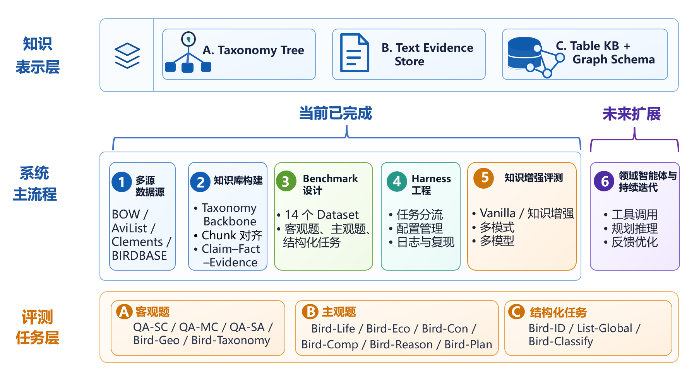
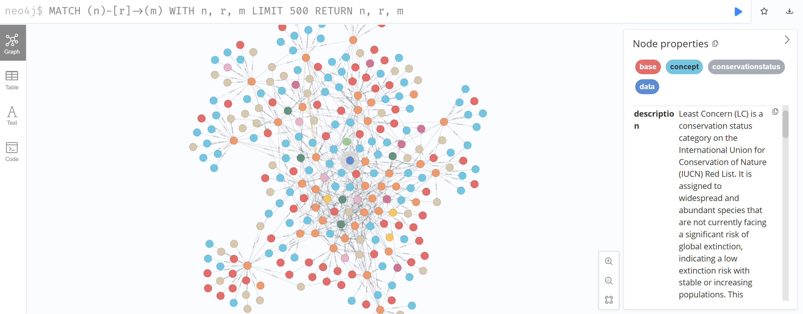
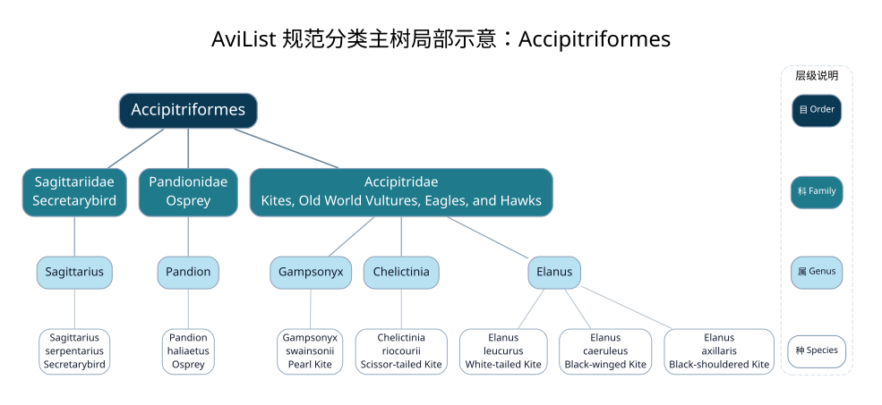
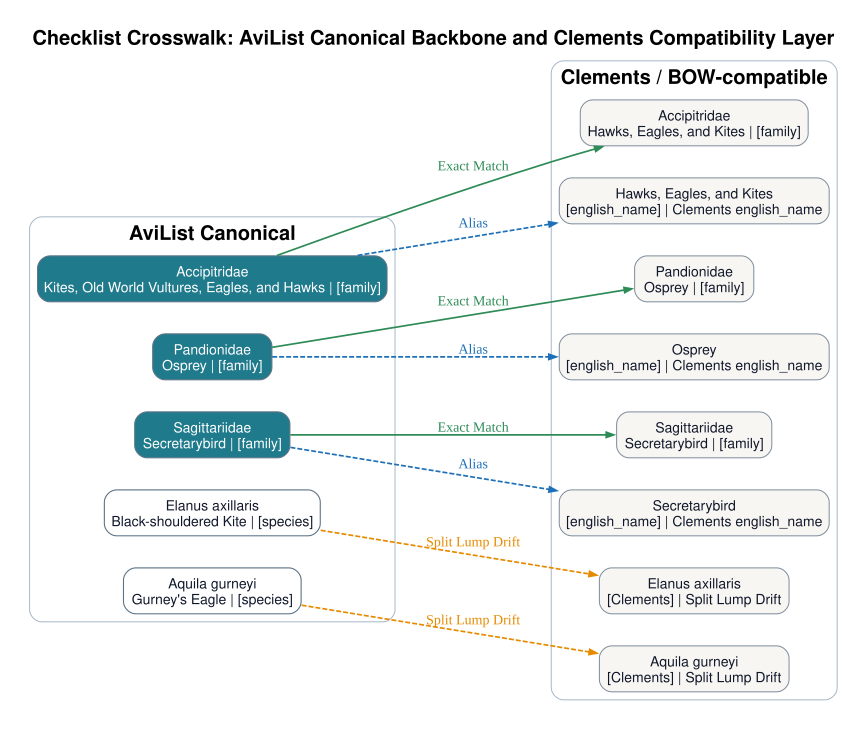
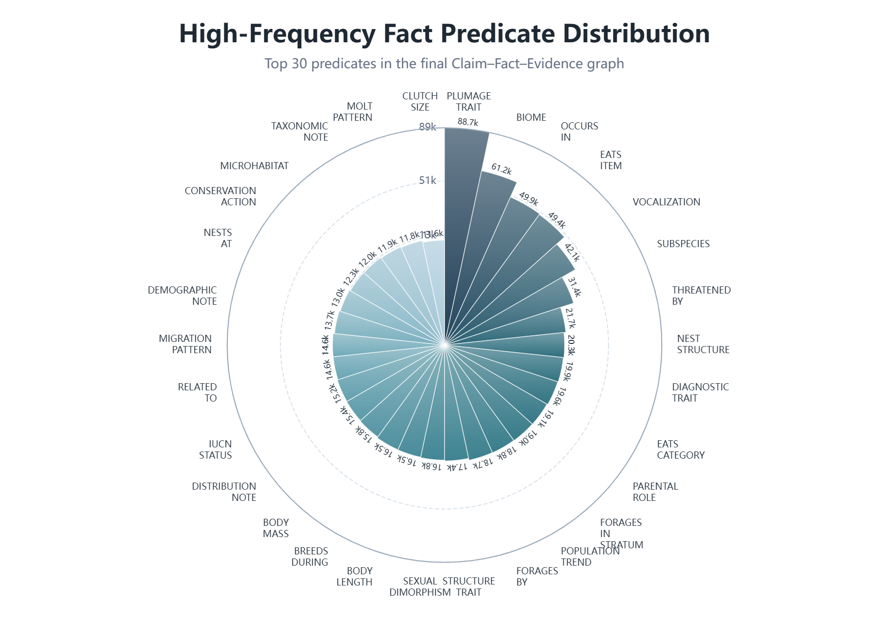
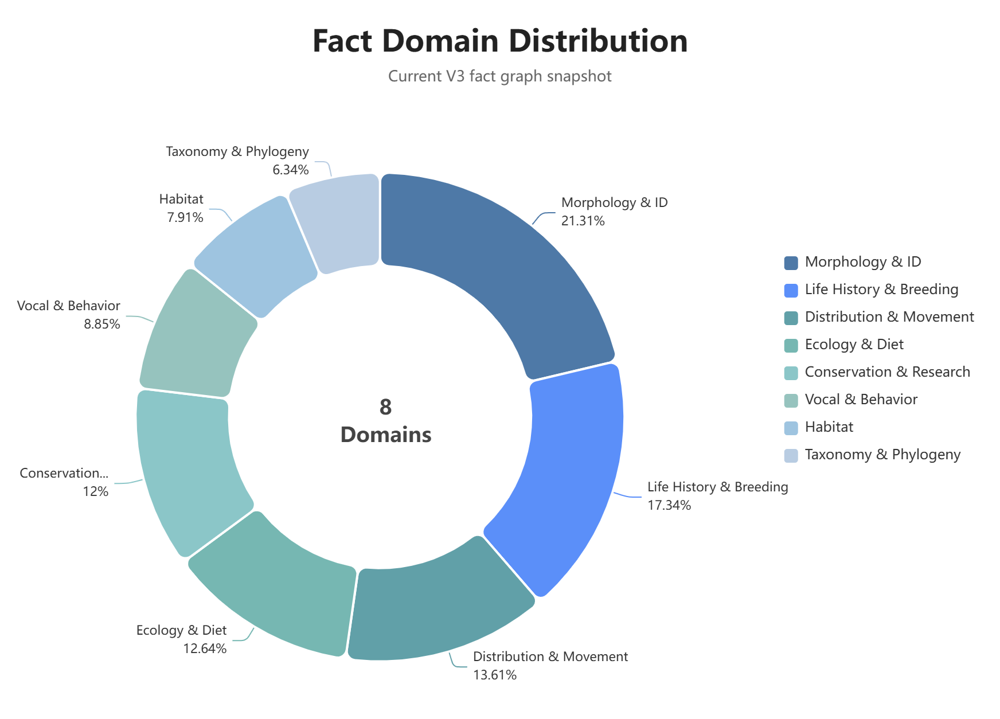

# Orniscient

**Orniscient** is a heterogeneous benchmark and knowledge-enhanced evaluation framework for bird ecology reasoning. It combines **14 task-oriented datasets**, a **multi-source bird knowledge base**, and a unified **knowledge-enhanced Harness** to study:

> **Under what conditions, and through what mechanisms, can multi-source bird knowledge improve large language models on bird ecology tasks?**

**Orniscient = Ornithology + Omniscient**  
The goal is to build a verifiable, traceable, and extensible infrastructure for bird ecology knowledge reasoning.

<div align="center">

[中文版本](./README_zh.md)/[English Version](./README.md)

</div>

---

## Project Overview

Large language models are strong in general question answering, but bird ecology knowledge is hierarchical, dynamic, evidence-dependent, and heterogeneous across sources. Standard LLMs can easily suffer from outdated knowledge, factual hallucination, taxonomic confusion, and missing provenance.

Orniscient is organized around three core components:

| Module | Role |
|---|---|
| **Bird Ecology Benchmark** | Evaluates LLMs on factual retrieval, domain reasoning, reverse species identification, conservation planning, and structured enumeration. |
| **Multi-source Knowledge Base** | Aligns taxonomy, BOW textual evidence, fact-level graph structures, and structured trait tables. |
| **knowledge_RAG Harness** | Compares vanilla and knowledge-enhanced settings under a unified evaluation protocol. |

The overall system workflow is shown below:



---

## Why Bird Ecology?

Bird ecology is not ordinary question answering. It requires models to understand taxonomy, natural-history text, geographic distribution, habitat, behavior, breeding, migration, and conservation evidence.

| Challenge | Description |
|---|---|
| **Dynamic taxonomy** | Species names, checklists, splits, and lumps continue to change. |
| **Clear hierarchy** | Bird knowledge is naturally organized by order, family, genus, species, subspecies, and related ranks. |
| **Long-form evidence** | Key information is scattered across BOW species and family records. |
| **Inconsistent sources** | BOW, AviList, Clements, and trait databases may follow different taxonomic views. |
| **Need for provenance** | Professional ecological answers should be grounded in authoritative sources and original evidence. |
| **Structured constraints** | Global species filtering tasks cannot rely only on free-form generation; they need structured statistics and filtering. |

For these reasons, Orniscient uses bird ecology as a representative setting for studying **LLM knowledge reasoning over heterogeneous scientific knowledge sources**.

---

## Core Contributions

1. **A bird ecology benchmark with 14 datasets**  
   Covering factual recall, taxonomic reasoning, geographic distribution, ecological synthesis, conservation analysis, reverse identification, and structured enumeration.

2. **A prototype multi-source bird knowledge base**  
   Aligning AviList, Clements, BOW records, BOW chunks, factual evidence, and structured trait tables through stable taxonomic anchors.

3. **A unified knowledge_RAG Harness**  
   Managing question loading, task routing, knowledge retrieval, model answering, scoring, logging, and result aggregation.

4. **Comparative analysis of knowledge enhancement**  
   Comparing vanilla and knowledge-enhanced results to analyze when external knowledge helps, when it fails, and why.

---

# Benchmark Design

## Design Principles

The Orniscient Benchmark is not a generic question set; it is a heterogeneous evaluation benchmark for bird ecology reasoning.

| Principle | Description |
|---|---|
| **Knowledge coverage** | Covers taxonomy, morphology, distribution, habitat, behavior, breeding, diet, ecological function, and conservation status. |
| **Reasoning hierarchy** | Extends from basic knowledge access to domain synthesis, multi-hop reasoning, conservation planning, and structured retrieval. |
| **Evidence traceability** | Questions and answers are designed to trace back to authoritative data sources wherever possible. |
| **Evaluation diversity** | Uses automatic metrics, LLM-as-a-Judge, Recall, Top-k accuracy, and hierarchical accuracy. |

## Task Taxonomy

Orniscient divides professional bird knowledge into two broad categories: knowledge acquisition and logical reasoning. The knowledge-acquisition branch contains eight areas: morphological identification, taxonomy and phylogeny, ecological function and diet, conservation status, vocal and acoustic behavior, daily behavior, ecology, and life history. Each area includes more detailed subtopics. The logical-reasoning branch groups complex tasks into four categories: multi-hop and abductive reasoning over long documents, conservation guideline planning under constraints, reverse species identification from masked descriptions, and global retrieval under multiple conditions.


According to task difficulty and the model capability being tested, Orniscient groups the 14 datasets into three levels:

1. **Level 1: Factual Knowledge Retrieval**  
   Tests whether a model knows basic facts about bird species, families, attributes, habitats, behavior, and conservation status. This corresponds to the eight knowledge-acquisition areas.

2. **Level 2: Domain Reasoning and Synthesis**  
   Tests whether a model can summarize, compare, and explain taxonomy, geographic distribution, ecological function, conservation status, life history, and similar-species differences. These tasks go deeper than Level 1 and focus on branch-level details within the knowledge map.

3. **Level 3: Complex Reasoning and Structured Retrieval**  
   Tests reverse identification, multi-hop reasoning, constrained planning, and global species-set enumeration. This corresponds to the logical-reasoning layer of the bird knowledge system.

## Dataset Overview

| Dataset | Subtask Type | Level | Size | Task Description | Knowledge Area | Construction Method | Metric |
| --- | ---: | ---: | ---: | ---: | ---: | ---: | ---: |
| QA-SC | | L1 | 2400 | Single-choice QA (1 out of 4): choose the only correct attribute, such as body mass, body length, or IUCN status, to evaluate basic factual retrieval. | Basic attributes | Programmatic family-stratified extraction based on BOW and SciQ | Accuracy |
| QA-MC | | L1 | 1200 | Multi-choice QA: select all correct descriptions from multiple options to evaluate integrated information verification. | Diet and habitat | LLM-generated multi-select questions based on BOW | EM / F1 |
| QA-SA | | L1 | 1200 | Short-answer QA: no options are provided; the model must output a specific entity name or value, testing precise extraction. | Morphology and facts | Keyword short-answer questions built from BOW, SciQ, and TriviaQA entities/values | EM / F1 |
| Bird-Geo | Geography, space, and time | L2 | 400 | Requires understanding cross-continental distribution, habitat preferences, and seasonal migration, testing spatial and temporal reasoning. | Distribution and habitat | BOW-based questions with programmatic geographic distractors | Accuracy |
| Bird-Taxonomy | Bird taxonomy | L2 | 800 | True/false or judgment questions based on monotypic species, subspecies changes, outdated names, nomenclature, or etymology, probing outdated biological knowledge and hallucination. | Taxonomy and phylogeny | Constructed from BOW historical taxonomy traps and monotypic-species markers | Accuracy |
| Bird-Classify | Hierarchical classification reasoning | L2 | 500 | Given anonymized morphological or behavioral descriptions, assign the bird to the correct order or family, testing hierarchical taxonomic reasoning. | Morphology, ecology, and behavior | Anonymized family-level feature descriptions generated from BOW | Accuracy / LLM-Eval |
| Bird-Comp | Morphological comparison | L2 | 1000 | Distinguish similar species and identify concrete morphological or behavioral differences among subspecies or close relatives, testing comparative reasoning. | Similar species and subspecies | Contrastive feature summaries extracted from explicit similar-species statements in BOW | LLM-Eval |
| Bird-Life | Ecology and life history | L2 | 400 | Evaluates whether a model understands complete breeding cycles, parental-care division, and developmental stages. | Breeding and life history | Chronological breeding timeline tasks built from BOW, ARC, and OBQA | LLM-Eval |
| Bird-Con | Conservation status assessment | L2 | 200 | Requires identifying major human threats and invasive-species impacts on a given species, testing risk assessment and synthesis. | Conservation and habitat | Anonymized threat summaries extracted from BOW and ARC | Recall / Accuracy |
| Bird-Eco | Ecological function reasoning | L2 | 200 | Requires analyzing a bird's role in a local ecosystem and potential trophic-cascade effects of local extinction. | Diet and habitat | BOW/ARC-based reasoning chains from diet to ecological function | LLM-Eval |
| Bird-ID | Abductive species diagnosis | L3 | 1000 | Given a deeply anonymized morphological or behavioral description, identify the unique target species, testing abductive identification. | Identification and behavioral traits | Diagnostic descriptions generated from BOW and CUB with geographic clues removed | Top-5 Accuracy |
| Bird-Reason | Long-text logical reasoning | L3 | 200 | Given a full species-account document, answer questions requiring cross-paragraph integration, such as attribution, correction, or multi-hop reasoning. | Complex logical reasoning | Full-length anonymized species monographs built from BOW with injected logical fallacies | LLM-Eval |
| Bird-Plan | Conservation planning | L3 | 100 | Given endangered-species data and strict real-world constraints such as limited budget or difficult terrain, generate a targeted conservation action plan. | Conservation planning and strategy | Built from BOW endangered-species records with explicit constraints injected | LLM-Eval |
| List-Global | Global conditional retrieval | L3 | 200 | Evaluates large-scale global retrieval under intersections of geography, species, and multiple attributes, such as diet + migration + status. | Global data synthesis | Species lists generated by multi-condition DataFrame logic over BIRDBASE | Recall / Accuracy |

## Benchmark Construction Workflow

Orniscient constructs questions from BOW, SciQ, TriviaQA, ARC, OBQA, CUB, BIRDBASE, and related sources, using task templates to constrain question generation. For QA-SC, QA-SA, Bird-Geo, List-Global, and other tasks that can be generated or checked programmatically, the system prioritizes rules and table logic to generate questions and gold answers. For open-generation tasks such as Bird-Comp, Bird-Life, Bird-Eco, Bird-Con, Bird-Reason, and Bird-Plan, LLM-assisted generation is used under explicit task templates, input constraints, and reference evidence.

For answer processing, objective and structured tasks use normalization, such as option normalization, keyword canonicalization, species-name matching, and list deduplication. Open-generation tasks retain reference answers, evidence summaries, or evaluation dimensions for later LLM-as-a-Judge scoring. For questions that rely on external knowledge, the system preserves traceable data sources, target entities, and evidence snippets wherever possible, so that the benchmark is not only a question set but also an evaluation resource for knowledge-enhanced retrieval and bad-case diagnosis.

LLM-as-a-Judge is mainly used for open-generation tasks that are difficult to score by exact matching. During evaluation, the judge scores answers based on reference answers, key facts, evidence coverage, logical consistency, and task completion, rather than superficial text similarity alone. For structured tasks such as Bird-ID and List-Global, the system focuses on whether the candidate set contains the correct answer, whether the output list is complete, and whether the taxonomic level matches.

---

# Knowledge Base Design

## Motivation

A single fixed RAG workflow cannot reliably support all bird ecology tasks. Bird knowledge simultaneously involves **taxonomic hierarchy**, **long-form natural-history evidence**, **qualified factual conditions**, and **structured trait constraints**. For example, Bird-Life and Bird-Con require synthesis from long BOW text; Bird-Taxonomy requires reliable hierarchy and checklist alignment; Bird-ID requires candidate-species recall; and List-Global depends more on table filtering than on free-form generation.

Therefore, Orniscient uses a multi-source knowledge design that separates the roles of text, tables, and graphs instead of compressing everything into a single vector database.

| Knowledge Source | Role |
|---|---|
| **AviList** | Builds the canonical taxonomy backbone. |
| **Clements Checklist** | Provides a Cornell/BOW-compatible layer for checklist differences. |
| **Birds of the World (BOW)** | Provides species- and family-level natural-history long-form evidence. |
| **BIRDBASE-style trait tables** | Provide structured trait filtering and multi-condition constraints. |
| **Fact graph** | Connects species, facts, evidence, and text chunks for traceable retrieval. |
| **Vector index** | Enables semantic recall over text chunks and fact descriptions. |

Domain knowledge is usually neither purely textual nor purely graph-structured; it is made of textual descriptions, entity relations, and structured attributes together. Orniscient is not about building a graph for its own sake. Its focus is to study **which tasks benefit from graph structure, textual evidence, and table constraints respectively**.

---

## Overall Knowledge Base Structure

The Orniscient knowledge base consists of three layers:

1. **Canonical Taxonomy Backbone** solves entity anchoring. Records, chunks, facts, evidence, and traits are attached to a unified `canonical_taxon_id` whenever possible.
2. **Text Evidence Store** preserves BOW species/family records and chapter-level chunks for open generation and evidence tracing.
3. **Fact Graph + Table KB** organizes structured facts, evidence, traits, and qualifiers into queryable paths for task-aware retrieval.



---

## Taxonomy Alignment

The first step in knowledge-base construction is building stable taxonomic anchors. Orniscient uses AviList as the canonical taxonomy backbone and Clements as a Cornell/BOW-compatible layer.

The `canonical_taxon_id` uniquely identifies the same biological entity and attaches BOW records, text chunks, Facts, Evidence, graph nodes, and table attributes to the same taxonomic entity. This resolves inconsistencies across sources and reduces mismatches caused by synonyms, outdated names, split/lump changes, and checklist differences.

### Taxonomy Tree Example

The following figure shows a local subtree of Accipitriformes in the AviList canonical taxonomy backbone. It illustrates how the system connects the order level downward to family, genus, and species. Orniscient provides a visualization script at `Orniscient/scripts/render_taxonomy_subtree.py`.



### Checklist Crosswalk Example

The following figure shows the mapping between the AviList canonical backbone and the Clements/BOW-compatible layer. Green edges indicate exact matches, blue dashed edges indicate aliases, and orange dashed edges indicate taxonomic differences such as split/lump drift.



---

## Text Evidence Store

The system parses BOW species records and family records into chapter-level chunks. Each chunk preserves its source chapter, subchapter, species name, family name, source file, and parent record information for traceability.

Core fields for each chunk include:

```text
chunk_id
canonical_taxon_id
common_name
scientific_name
record_type
source_chapter
source_chapter_raw
source_subchapter
text
```

Chunks no longer perform independent taxonomic matching; instead, they inherit the `canonical_taxon_id` from the parent record. This avoids incorrectly attaching chunks from the same species to related or homonymous entities, reducing taxonomy drift during retrieval.

---

## Claim-Fact-Evidence-Qualifier Modeling

Bird ecology facts are often not globally true. A bird's habitat, breeding behavior, migration status, sexual differences, or conservation threats may depend on region, season, age, sex, subspecies, population, and uncertainty. Therefore, Orniscient does not compress BOW text into flat triples. Instead, it models four object types:

| Object | Role |
|---|---|
| `Claim` | Natural-language assertions extracted from chunks, preserving source semantics as much as possible. |
| `Fact` | Normalized fact nodes used for retrieval, comparison, and aggregation. |
| `Evidence` | Original evidence snippets supporting claims or facts. |
| `Qualifier` | Conditions under which a fact holds, such as region, season, sex, age, subspecies, time, uncertainty, and scope. |

This design supports two needs at once: models can receive natural-language context, while the system can locate facts and evidence along structured paths.

---

## Graph Schema

The core graph path is:

```text
Taxon → Fact → Evidence → Chunk
```

This path reflects the basic logic of knowledge-enhanced retrieval:

1. Locate the target `Taxon` from the question entity.
2. Select relevant `Fact` nodes according to the task type.
3. Trace back from `Evidence` to source snippets.
4. Assemble the corresponding `Chunk` or evidence span as model context.

Extensible relationships include:

```text
Taxon → ParentTaxon
Taxon → Trait
Taxon → Alias
Taxon → ChecklistEntry
Fact → Qualifier
Fact → Evidence
Evidence → Chunk
```

The schema is designed to connect three kinds of information:

| Information Type | Graph Representation | Problem Addressed |
|---|---|---|
| Taxonomic hierarchy | `Taxon → ParentTaxon` | Supports order/family/genus/species-level reasoning. |
| Text evidence | `Fact → Evidence → Chunk` | Supports fact tracing and context construction. |
| Structured attributes | `Taxon → Trait` | Supports constrained retrieval for List-Global, Bird-ID, and related tasks. |
| Checklist differences | `Taxon → Alias / ChecklistEntry` | Supports old names, synonyms, and split/lump compatibility. |

---

## Knowledge Graph Construction Workflow

Orniscient first builds the canonical taxonomy backbone with AviList and uses Clements to remain compatible with the Cornell/BOW system, producing stable canonical taxon IDs. This layer addresses synonyms, taxonomic changes, and alignment across different checklists.

Next, BOW species records and family records are attached to their corresponding canonical taxon IDs and split into chunks according to the original BOW chapter structure. Each chunk inherits the taxonomic anchor of its parent record, avoiding taxonomic drift that can occur when chunks are matched independently.

During fact extraction, Orniscient extracts Claims from chunks, normalizes them into Facts, and preserves both supporting Evidence and Qualifiers that describe the conditions under which a fact holds. This avoids reducing bird ecology knowledge to flat triples without source or scope.

Finally, Orniscient materializes Taxon, Fact, Evidence, Chunk, Trait, and related objects as graph nodes and relations, and performs schema validation, isolated-node checks, fact-evidence backlink checks, and evidence-traceability checks. After validation, the graph can be connected to Neo4j, vector indexes, and table knowledge bases for downstream knowledge-enhanced retrieval.

---

### Current Core Claim-Fact-Evidence Graph Scale

In the final V3 Claim-Fact-Evidence construction stage, Orniscient processed **309,369 aligned chapter-level BOW chunks** and produced **921,161 official Claims**. The system then globally normalized semantically equivalent Claims under the same taxon into **891,862 Facts**, **815,896 Evidence records**, and **915,793 Fact-Evidence Links**. Based on the `Taxon → Fact → Evidence → Chunk` core path, the current core graph awaiting materialization is estimated at approximately **2,028,249 core nodes** and **2,623,551 core edges**.

The graph layer in Orniscient is not intended to store the full BOW long-form text inside the graph database. Fact and Evidence nodes mainly serve as structured indexes, evidence anchors, and traceable pointers. The long natural-language context needed for open-ended generation is still provided by the local chunk store or vector index. In other words, the graph answers "where should we look, and based on what kind of fact?", while the vector index and chunk store provide the long textual content used for generation.

#### Overall Artifact Scale

| Metric | Count |
| --- | ---: |
| Processed BOW chunks | 309,369 |
| Species claims | 912,598 |
| Family claims | 8,563 |
| Total claims | 921,161 |
| Species facts | 883,500 |
| Family facts | 8,362 |
| Total facts | 891,862 |
| Evidences | 815,896 |
| Fact-Evidence links | 915,793 |
| Supplement accepted claims | 331,827 |
| Supplement covered chunks | 93,542 |
| Hit soft-cap chunks | 33,211 |
| Fact ID collisions | 0 |
| Extractor failures | 0 |

#### Core Graph Size Estimate

| Node Label | Count |
| --- | ---: |
| Taxon | 11,122 |
| Fact | 891,862 |
| Evidence | 815,896 |
| Chunk | 309,369 |
| Total core nodes | 2,028,249 |

| Concept Edge Type | Relation Name | Count |
| --- | --- | ---: |
| Taxon -> Fact | HAS_FACT | 891,862 |
| Fact -> Evidence | SUPPORTED_BY | 915,793 |
| Evidence -> Chunk | FROM_CHUNK | 815,896 |
| Total core edges |  | 2,623,551 |

#### Supplementary Claim Extraction Strategy Validation

To mitigate recall loss caused by early per-chunk Claim caps, Orniscient validated a supplementary extraction strategy on high-risk chunks that reached the previous extraction cap. The system first identified **93,542 at/over-cap chunks** and then compared how different supplementary extraction budgets affected Claim quality on small samples.

| Comparison | Faithfulness | Novelty | Non-duplicate | Atomicity | Predicate/domain fit | Practical usefulness | Overall pass | Near-duplicate |
|---|---:|---:|---:|---:|---:|---:|---:|---:|
| max=6 | 97.27% | 94.55% | 95.45% | 97.27% | 96.97% | 89.09% | 88.18% | 6.06% |
| 12-extra | 93.01% | 65.50% | 65.94% | 92.14% | 97.38% | 55.46% | 53.28% | 36.24% |
| 6+6 Round2 | 98.37% | 75.92% | 76.33% | 95.10% | 99.59% | 73.88% | 71.43% | 35.51% |

The results show that although a single-round `max=12` setting can generate more Claims, the 7th to 12th added Claims show clear declines in novelty, non-duplication, and practical usefulness. `6+6 Round2` is more stable than `12-extra`, but the second round still carries a high near-duplicate risk. In the 55-sample test, Round2 produced 245 additional Claims; 51/55 chunks still had new Claims, and 31/55 chunks hit the cap again.

Therefore, the final full supplementary extraction uses a **single-pass additional-6** strategy: each high-risk chunk can receive at most 6 high-value additional Claims, with no Round2 continuation. In total, **331,827 supplementary claims** were merged into Claim v2, and **33,211 hit soft-cap chunks** were retained as a future high-recall expansion list.

#### V3 Fact Extraction Scale and Knowledge Coverage

In the V3 fact graph construction stage, Orniscient used chapter-level BOW chunks as the basic input and executed the following extraction and normalization pipeline:

```text
Chunk → Claim → Fact → Evidence → Fact–Evidence Link
```

Every step can be traced back to a concrete chunk.

#### Fact Domains and Controlled Relation Schema

To ensure that extracted facts have consistent semantic structure, comparability, and traceability, Orniscient does not ask the LLM to freely generate open triples in Step 3. Instead, it uses controlled fact domains and controlled predicates. Bird natural-history knowledge is divided into 8 core fact domains, and each domain has a predefined set of relation types. This constrains the semantic space of extraction results and reduces schema drift and fragmented wording.

The current schema contains 8 fact domains and 74 controlled predicates. Predicate Count denotes the number of controlled predicate types defined under each fact domain. The Controlled Predicates column lists the complete schema, not frequency counts.

| Fact Domain | Predicate Count | Controlled Predicates |
| --- | ---: | --- |
| TaxonomyAndPhylogeny | 8 | `HAS_SUBSPECIES`, `HAS_GEOGRAPHIC_VARIATION`, `HAS_SUBSPECIES_TRAIT`, `HAS_SUBSPECIES_DISTRIBUTION`, `HYBRIDIZES_WITH`, `RELATED_TO`, `HAS_CLASSIFICATION_HISTORY`, `HAS_TAXONOMIC_NOTE` |
| MorphologyAndIdentification | 13 | `HAS_BODY_LENGTH`, `HAS_BODY_MASS`, `HAS_WING_LENGTH`, `HAS_TAIL_LENGTH`, `HAS_BILL_LENGTH`, `HAS_TARSUS_LENGTH`, `HAS_WINGSPAN`, `HAS_PLUMAGE_TRAIT`, `HAS_MOLT_PATTERN`, `HAS_SEXUAL_DIMORPHISM`, `HAS_AGE_DIMORPHISM`, `HAS_DIAGNOSTIC_TRAIT`, `HAS_STRUCTURE_TRAIT` |
| DistributionAndMovement | 8 | `OCCURS_IN`, `ENDEMIC_TO`, `BREEDS_IN`, `WINTERS_IN`, `MIGRATES_VIA`, `HAS_MIGRATION_PATTERN`, `HAS_ELEVATION_RANGE`, `HAS_DISTRIBUTION_NOTE` |
| Habitat | 2 | `INHABITS_BIOME`, `USES_MICROHABITAT` |
| EcologyAndDiet | 5 | `EATS_CATEGORY`, `EATS_ITEM`, `FORAGES_BY`, `FORAGES_IN_STRATUM`, `HAS_ECOLOGICAL_ROLE` |
| VocalAndBehavior | 18 | `HAS_VOCALIZATION_TYPE`, `CALLS_DURING`, `HAS_NONVOCAL_SOUND`, `HAS_SOUND_DIAGNOSTIC`, `HAS_SOCIAL_BEHAVIOR`, `HAS_TERRITORIAL_BEHAVIOR`, `HAS_LOCOMOTION_STYLE`, `HAS_FLIGHT_ABILITY`, `HAS_RUNNING_SPEED`, `HAS_JUMP_HEIGHT`, `HAS_SWIMMING_ABILITY`, `HAS_CLIMBING_ABILITY`, `HAS_DAILY_ACTIVITY_PATTERN`, `HAS_COURTSHIP_BEHAVIOR`, `HAS_MATING_SYSTEM`, `HAS_PAIR_BOND`, `HAS_COPULATION_BEHAVIOR`, `HAS_AGONISTIC_BEHAVIOR` |
| LifeHistoryAndBreeding | 10 | `BREEDS_DURING`, `NESTS_AT`, `HAS_NEST_STRUCTURE`, `HAS_EGG_TRAIT`, `HAS_CLUTCH_SIZE`, `HAS_INCUBATION_PERIOD`, `HAS_FLEDGING_PERIOD`, `HAS_PARENTAL_ROLE`, `HAS_DEVELOPMENT_NOTE`, `HAS_DEMOGRAPHIC_NOTE` |
| ConservationAndResearch | 10 | `HAS_IUCN_STATUS`, `HAS_POPULATION_TREND`, `THREATENED_BY`, `HAS_CONSERVATION_ACTION`, `INTERACTS_WITH_HUMANS`, `HAS_PREDATOR`, `HAS_PARASITE`, `HAS_DISEASE`, `HAS_MORTALITY_CAUSE`, `REQUIRES_RESEARCH_ON` |

Under this design, each Fact contains not only subject, predicate, and object, but also an explicit fact domain and a `Fact → Evidence → Chunk` link back to the original BOW text snippet. This gives the knowledge graph both fine-grained ecological facts and stable statistical and reproducible knowledge-enhancement interfaces.

##### High-Frequency Fact Predicate Distribution

The table below shows the most frequent fact relations in the current extraction results. The graph covers not only basic knowledge such as distribution, habitat, and conservation status, but also fine-grained ecological facts such as vocalization, parental behavior, nest structure, egg traits, migration patterns, and quantitative morphology. For different question types, the system can directly locate relevant Fact nodes and trace them back to source text snippets.



| Predicate | Fact Count |
|---|---:|
| HAS_PLUMAGE_TRAIT | 88,726 |
| INHABITS_BIOME | 61,235 |
| OCCURS_IN | 49,913 |
| EATS_ITEM | 49,404 |
| HAS_VOCALIZATION_TYPE | 42,121 |
| HAS_SUBSPECIES | 31,396 |
| THREATENED_BY | 21,709 |
| HAS_NEST_STRUCTURE | 20,342 |
| HAS_DIAGNOSTIC_TRAIT | 19,945 |
| EATS_CATEGORY | 19,633 |
| HAS_PARENTAL_ROLE | 19,075 |
| FORAGES_IN_STRATUM | 18,980 |
| HAS_POPULATION_TREND | 18,817 |
| FORAGES_BY | 18,706 |
| HAS_STRUCTURE_TRAIT | 17,377 |
| HAS_SEXUAL_DIMORPHISM | 16,829 |
| HAS_BODY_LENGTH | 16,534 |
| BREEDS_DURING | 16,496 |
| HAS_BODY_MASS | 15,763 |
| HAS_DISTRIBUTION_NOTE | 15,370 |
| HAS_IUCN_STATUS | 15,166 |
| RELATED_TO | 14,646 |
| HAS_MIGRATION_PATTERN | 14,634 |
| HAS_DEMOGRAPHIC_NOTE | 13,663 |
| NESTS_AT | 13,002 |
| HAS_CONSERVATION_ACTION | 12,263 |
| USES_MICROHABITAT | 12,021 |
| HAS_TAXONOMIC_NOTE | 11,924 |
| HAS_MOLT_PATTERN | 11,839 |
| HAS_CLUTCH_SIZE | 11,635 |

#### Fact Domain Distribution

The V3 fact graph extraction covers multiple major dimensions of bird ecology knowledge. Morphology and identification, breeding and life history, distribution and movement, ecology and diet, and conservation research all contain large numbers of Fact nodes. This indicates that the graph is not built around a single class of shallow attributes, but organizes BOW natural-history text along multiple knowledge dimensions.



| Fact Domain | Fact Count | Share |
|---|---:|---:|
| MorphologyAndIdentification | 217,286 | 24.36% |
| LifeHistoryAndBreeding | 137,996 | 15.47% |
| EcologyAndDiet | 120,624 | 13.53% |
| DistributionAndMovement | 102,493 | 11.49% |
| ConservationAndResearch | 85,579 | 9.60% |
| TaxonomyAndPhylogeny | 77,600 | 8.70% |
| VocalAndBehavior | 76,755 | 8.61% |
| Habitat | 73,529 | 8.24% |


---

## Visualization and Qualitative Analysis

Orniscient uses three types of visualizations to present knowledge-base construction results:

| Visualization | Content | Role |
|---|---|---|
| Taxonomy Tree | Shows a local tree structure of the AviList canonical backbone. | Explains how the taxonomy backbone organizes order/family/genus/species. |
| Checklist Crosswalk | Shows mappings between AviList and the Clements/BOW-compatible layer. | Explains exact matches, aliases, split/lump drift, and other compatibility relations. |
| KG Subgraph | Shows the Fact, Evidence, and Chunk neighborhood around a target species. | Explains how the graph supports evidence tracing and task-aware retrieval. |

The taxonomy tree is best suited for showing the classification backbone, the crosswalk is best suited for showing multi-checklist alignment, and the KG subgraph is best suited for showing how the graph supports RAG.

---

## How to Visualize the Taxonomy Tree

If you want to visualize the bird taxonomy backbone as a tree, avoid drawing the full graph directly; the full tree is too large to read. This repository provides a visualization script for local use:

1. Choose an order or family as the root node, such as `Accipitriformes`.
2. Read nodes and parent-child edges from `canonical_taxon_nodes.jsonl` and `canonical_taxon_edges.jsonl`.
3. Assign colors or shapes by rank.
4. Keep only a local subtree, such as order → family → genus → species.
5. Export to `.png`, `.svg`, or `.dot` under `docs/assets/`.

Recommended outputs:

```text
docs/assets/taxonomy_tree_accipitriformes.png
docs/assets/checklist_crosswalk_accipitriformes.png
docs/assets/kg_subgraph_example.png
```

---

# Knowledge-Enhanced Harness

The knowledge-enhanced Harness manages the evaluation workflow: question loading → task routing → knowledge-mode selection → retrieval/querying → context construction → LLM answering → scoring/Judge → aggregation and analysis.

It supports selecting one or multiple datasets and the Zero-shot, Few-shot, and CoT modes, and compares `none` (vanilla) with `hybrid` (knowledge-enhanced) configurations.

The Harness records run manifests, context logs, model answers, judge outputs, aggregate results, and bad-case logs for reproducibility and diagnosis.

---

# Experiments and Analysis

## Experimental Setup

Orniscient compares vanilla and knowledge-enhanced models under the same question sets, prompts, models, and scoring scripts. The goal is not to simply prove that "knowledge enhancement always helps", but to analyze **which tasks benefit from external knowledge, which tasks do not, and whether failures come from retrieval, evidence organization, task constraints, or the model's ability to use evidence**.

| Setting | Description |
|---|---|
| Vanilla | No external knowledge. |
| Text-RAG | Uses BOW text chunks. |
| KG-RAG v1 | Uses an early graph retrieval baseline. |
| KG-RAG v3 | Uses the Taxon-Fact-Evidence graph. |
| Hybrid KG-RAG | Fuses graph, text, tables, and reranker signals. |

Prompt settings include:

| Mode | Description |
|---|---|
| Zero-shot | Direct answering. |
| Few-shot | Provides example answers. |
| CoT | Reasoning-style prompting. |

> Note: all results below are percentages (%). Bird-Classify Type1 refers to an open-ended task that generates feature details given a family or taxon; Type2 refers to a structured classification task that identifies order/family from a description. `--` means that the corresponding evaluation was not separately configured under that mode.

---

## Experimental Results

### Vanilla Results

#### Objective QA Scores

| Model | QA-SC | QA-MC (EM/F1) | QA-SA | Bird-Geo | Bird-Taxonomy (EM/F1) |
|---|---:|---:|---:|---:|---:|
| DeepSeek-V3.2 | 78.61 | 38.62 / 83.59 | 13.77 | 90.62 | 20.48 / 40.23 |
| qwen3-max | 75.12 | 45.12 / 85.22 | 11.28 | 87.47 | 19.05 / 36.52 |
| glm-5 | 42.98 | 1.28 / 72.31 | 11.61 | 46.00 | 27.65 / 34.87 |
| doubao-seed-2-0-pro-260215 | 84.29 | 50.69 / 88.79 | 16.11 | 91.74 | 20.00 / 38.70 |
| hunyuan-turbos-latest | 73.06 | 27.85 / 77.62 | 11.59 | 82.14 | 23.64 / 40.75 |
| ernie-4.5-turbo-128k | 72.49 | 31.66 / 78.54 | 9.02 | 81.54 | 13.19 / 33.21 |
| MiniMax-M2.7 | 16.33 | 2.19 / 75.64 | 22.41 | 24.33 | 5.36 / 39.14 |

Vanilla models show clear differences on objective questions. DeepSeek, qwen, doubao, and hunyuan perform strongly on QA-SC and Bird-Geo, suggesting good basic factual judgment and common distribution knowledge. However, QA-SA and Bird-Taxonomy scores are generally low, indicating that short-answer generation and precise taxonomic matching remain difficult. MiniMax-M2.7 is relatively strong on QA-SA but much weaker on QA-SC and Bird-Geo, showing that capability boundaries differ across models.

#### Subjective and Structured Task Scores

| Model | Bird-Classify Type1 | Bird-Classify Type2 | Bird-Life | Bird-Eco | Bird-Con | Bird-Comp | Bird-Reason | Bird-ID | List-Global | Bird-Plan |
|---|---:|---:|---:|---:|---:|---:|---:|---:|---:|---:|
| DeepSeek-V3.2 | 61.37 | 86.83 | 23.47 | 33.51 | 33.77 | 31.35 | 84.51 | 26.71 | 8.20 | 94.32 |
| DeepSeek-V3.2 with Few-shot | 63.65 | -- | 24.86 | 44.19 | 40.58 | 31.76 | 82.50 | 18.99 | 7.13 | 93.92 |
| DeepSeek-V3.2 with CoT | 61.30 | -- | 28.78 | 36.03 | 36.80 | 28.24 | 84.19 | 32.12 | 14.33 | 92.97 |
| glm-5 | 59.21 | 100.00 | 9.31 | 16.33 | 22.08 | 35.31 | 70.15 | 12.97 | 3.27 | 96.88 |
| glm-5 with Few-shot | 62.00 | -- | 40.99 | 45.65 | 27.96 | 21.67 | 70.36 | 17.58 | 4.77 | 95.02 |
| glm-5 with CoT | 59.02 | -- | 9.38 | 29.38 | 23.82 | 31.67 | 84.17 | 13.56 | 6.64 | 98.12 |
| doubao-seed-2-0-pro | 64.06 | 94.61 | 15.95 | 36.08 | 24.78 | 29.05 | 84.86 | 42.93 | 9.41 | 98.87 |
| doubao-seed-2-0-pro with Few-shot | 64.58 | -- | 17.30 | 39.59 | 21.34 | 25.68 | 77.70 | 33.64 | 7.89 | 98.33 |
| doubao-seed-2-0-pro with CoT | 63.26 | -- | 14.86 | 33.73 | 24.42 | 26.62 | 84.19 | 48.89 | 19.61 | 99.09 |
| hunyuan-turbos-latest | 64.91 | 81.74 | 25.41 | 41.35 | 21.48 | 30.95 | 81.57 | 8.28 | 9.50 | 97.03 |
| hunyuan-turbos-latest with Few-shot | 73.05 | -- | 20.68 | 48.46 | 31.62 | 26.62 | 80.73 | 13.56 | 9.29 | 96.08 |
| hunyuan-turbos-latest with CoT | 64.13 | -- | 26.89 | 44.32 | 22.11 | 32.84 | 80.24 | 17.58 | 11.70 | 94.05 |
| ernie-4.5-turbo-128k | 65.04 | 100.00 | 34.61 | 35.45 | 28.48 | 29.33 | 86.60 | 34.62 | 29.61 | 98.12 |
| ernie-4.5-turbo-128k with Few-shot | 70.94 | -- | 20.91 | 31.11 | 30.47 | 23.33 | 79.81 | 33.01 | 29.01 | 99.09 |
| ernie-4.5-turbo-128k with CoT | 63.49 | -- | 31.25 | 27.78 | 30.58 | 31.06 | 83.92 | 35.64 | 33.33 | 95.28 |
| MiniMax-M2.7 | 87.27 | 69.64 | 90.27 | 83.78 | 88.24 | 97.57 | 94.73 | 3.19 | 1.28 | 96.31 |
| MiniMax-M2.7 with Few-shot | 62.88 | -- | 23.78 | 40.61 | 35.28 | 31.22 | 78.41 | 9.90 | 1.04 | 96.62 |
| MiniMax-M2.7 with CoT | 83.68 | -- | 92.57 | 80.41 | 91.76 | 76.22 | 92.03 | 4.91 | 1.12 | 96.98 |

On subjective and structured tasks, vanilla models show even stronger task differences. MiniMax-M2.7 performs well on open-generation tasks such as Bird-Life, Bird-Eco, Bird-Con, and Bird-Comp, but scores low on Bird-ID and List-Global. This shows that strong open-generation ability does not necessarily imply strong structured retrieval ability. Bird-ID and List-Global are difficult overall, reflecting that reverse identification and global set enumeration cannot rely only on parametric memory and free-form generation.

---

### Knowledge-Enhanced Results

#### Objective QA Scores

| Model | QA-SC | QA-MC | QA-SA | Bird-Geo | Bird-Taxonomy (EM/F1) |
|---|---:|---:|---:|---:|---:|
| DeepSeek-V3.2 | 90.82 | 88.93 | 25.81 | 97.77 | 22.00 / 44.13 |
| qwen3-max | 90.59 | 82.66 | 24.66 | 97.97 | 18.00 / 41.38 |
| glm-5 | 47.65 | 0.34 | 24.13 | 62.96 | 10.64 / 37.40 |
| doubao-seed-2-0-pro-260215 | 95.00 | 79.58 | 18.41 | 98.46 | 20.00 / 41.47 |
| hunyuan-turbos-latest | 88.29 | 82.24 | 23.79 | 97.32 | 24.00 / 40.80 |
| ernie-4.5-turbo-128k | 23.33 | 0.47 | 24.06 | 26.00 | 26.40 / 39.21 |
| MiniMax-M2.7 | 46.33 | 76.70 | 24.88 | 55.00 | 8.00 / 37.37 |

Knowledge enhancement has a clear task-dependent effect on objective questions. Most models improve on QA-SC, QA-SA, and Bird-Geo, suggesting that external textual evidence and structured knowledge can compensate for missing parametric knowledge. QA-MC and Bird-Taxonomy are less stable: multi-choice questions are sensitive to option boundaries and distracting evidence, while taxonomy tasks depend on taxonomy alignment, name normalization, and output-format control. Knowledge enhancement is therefore not simply about expanding context; it requires precise retrieval, chapter filtering, and answer constraints.

#### Subjective and Structured Task Scores

| Model | Bird-Classify Type1 | Bird-Classify Type2 | Bird-Life | Bird-Eco | Bird-Con | Bird-Comp | Bird-Reason | Bird-ID | List-Global | Bird-Plan |
|---|---:|---:|---:|---:|---:|---:|---:|---:|---:|---:|
| DeepSeek-V3.2 | 77.61 | 98.20 | 87.08 | 91.01 | 92.59 | 81.16 | 95.67 | 40.71 | 70.30 | 97.54 |
| DeepSeek-V3.2 with Few-shot | 76.23 | -- | 87.95 | 92.90 | 93.44 | 83.35 | 97.25 | 38.48 | 72.15 | 96.16 |
| DeepSeek-V3.2 with CoT | 76.71 | -- | 85.64 | 92.69 | 93.09 | 81.27 | 96.11 | 38.60 | 71.75 | 95.48 |
| glm-5 | 81.67 | 100.00 | 87.47 | 95.07 | 93.86 | 88.60 | 97.27 | 70.48 | 72.20 | 97.83 |
| glm-5 with Few-shot | 70.83 | -- | 87.22 | 94.93 | 93.51 | 91.18 | 98.84 | 70.20 | 74.37 | 97.95 |
| glm-5 with CoT | 83.04 | -- | 87.50 | 94.08 | 95.71 | 89.20 | 97.73 | 72.00 | 72.80 | 97.21 |
| doubao-seed-2-0-pro | 84.41 | 98.08 | 86.73 | 95.03 | 94.35 | 82.75 | 98.29 | 35.29 | 76.47 | 98.71 |
| doubao-seed-2-0-pro with Few-shot | 85.88 | -- | 88.53 | 92.70 | 94.03 | 82.27 | 98.44 | 35.29 | 77.74 | 98.73 |
| doubao-seed-2-0-pro with CoT | 83.53 | -- | 86.52 | 93.11 | 94.29 | 82.94 | 98.27 | 33.51 | 72.80 | 98.47 |
| hunyuan-turbos-latest | 76.38 | 97.90 | 87.48 | 94.09 | 95.22 | 80.22 | 97.23 | 42.16 | 65.25 | 98.65 |
| hunyuan-turbos-latest with Few-shot | 76.44 | -- | 86.15 | 91.37 | 94.14 | 78.52 | 97.15 | 44.30 | 68.20 | 98.81 |
| hunyuan-turbos-latest with CoT | 74.53 | -- | 96.71 | 91.97 | 95.04 | 79.96 | 96.11 | 30.72 | 71.75 | 97.70 |
| ernie-4.5-turbo-128k | 73.04 | 100.00 | 89.12 | 92.79 | 91.20 | 84.60 | 98.16 | 18.62 | 70.80 | 97.12 |
| ernie-4.5-turbo-128k with Few-shot | 74.53 | -- | 88.41 | 93.42 | 90.16 | 86.32 | 98.16 | 17.01 | 71.20 | 98.21 |
| ernie-4.5-turbo-128k with CoT | 77.10 | -- | 88.30 | 91.99 | 93.83 | 84.87 | 97.67 | 16.67 | 72.80 | 98.33 |
| MiniMax-M2.7 | 91.27 | 76.47 | 93.30 | 96.04 | 94.48 | 85.99 | 97.08 | 16.62 | 72.80 | 98.49 |
| MiniMax-M2.7 with Few-shot | 81.67 | -- | 89.06 | 92.01 | 95.75 | 88.90 | 98.57 | 15.29 | 67.20 | 98.65 |
| MiniMax-M2.7 with CoT | 89.90 | -- | 90.97 | 92.53 | 95.06 | 84.87 | 98.44 | 29.41 | 70.20 | 99.52 |

Knowledge enhancement brings the most stable improvements on open-generation tasks. Bird-Life, Bird-Eco, Bird-Con, Bird-Comp, and Bird-Reason generally achieve high scores, showing that external evidence can significantly improve answer quality when the task requires factual synthesis, detail coverage, and evidence organization. Improvements on structured tasks are more path-dependent: List-Global improves substantially after knowledge enhancement, indicating that table filtering and structured constraints are critical for global set enumeration; Bird-ID improves as well, but remains limited by candidate recall and reranker quality, with large differences across models.

---

## Overall Analysis

### When Is Knowledge Enhancement Effective?

The results suggest that knowledge enhancement is mainly effective in three scenarios:

1. **Tasks with explicit target entities and locatable evidence**  
   Examples include QA-SC, QA-SA, Bird-Life, and Bird-Con. The system can first locate the target species or family and then retrieve relevant chunks, facts, and evidence, reducing the risk of answering from memory alone.

2. **Open-generation tasks requiring factual coverage and detail organization**  
   Subjective tasks generally benefit from external evidence because models need to integrate distribution, behavior, breeding, diet, conservation threats, and other information. The knowledge base provides a more stable source of facts.

3. **Set tasks requiring structured constraints**  
   List-Global improves substantially with knowledge enhancement, showing that such tasks should not rely on free-form generation. BIRDBASE-style table filtering or graph constraints should first determine the candidate set.

### When Does Knowledge Enhancement Fail?

Knowledge enhancement can also fail, especially in the following scenarios:

1. **Unclear boundaries in multi-choice questions**  
   QA-MC requires judging multiple options simultaneously. Retrieved evidence may support only part of an option or introduce distracting information.

2. **Rare records or ambiguous geographic wording**  
   In Bird-Geo, vagrant records, migration ranges, and region qualifiers can affect model judgments. Longer context does not necessarily improve reliability.

3. **Candidate recall misses the correct answer**  
   The core bottleneck in Bird-ID is whether the candidate set contains the correct species. If recall fails, even a strong reasoning model may not recover.

4. **Weak model ability to use evidence**  
   In List-Global, there are cases where the system already filtered a completely correct species list, but the model removed some correct species during answer generation, lowering the final score.

### Why Does the Graph Help Models?

The value of the graph is not that it replaces text with graph structure, but that it provides a more stable knowledge access path:

```text
Taxon → Fact → Evidence → Chunk
```

This path provides three advantages:

- **Entity anchoring**: `canonical_taxon_id` reduces mismatches caused by synonyms, taxonomic changes, and checklist differences.
- **Evidence tracing**: Facts can trace back to Evidence and then to original Chunks, making answers auditable.
- **Task-aware retrieval**: Different tasks can choose different routes. Target-entity QA can use Taxon-Fact-Evidence-Chunk; Bird-ID can use candidate recall; List-Global can use table filtering.

Therefore, the conclusion of Orniscient is not that "a knowledge base always improves models", but that **the effect of knowledge enhancement depends on knowledge coverage, retrieval recall, context construction, output constraints, and the model's ability to use evidence**.

### Knowledge-Enhanced Examples

This section gives three examples in which knowledge enhancement improves different models on objective, subjective, and structured tasks.

#### Example 1: External Evidence Corrects an Objective Fact Error

> Question: What is described as the single most important threat to the continued existence of Hawaiian Duck?
> Options:
> "A": "Habitat loss due to wetland destruction"
> "B": "Predation from introduced mammals"
> "C": "Hybridization with feral Mallards"
> "D": "Sport hunting in the early 20th century"

In `qa_sc_0014` from the `QA-SC` dataset, the question focuses on a species-level fact about **Hawaiian Duck**.  
Under the vanilla setting, Doubao chose the wrong answer `A`; after external knowledge was added, the model changed its answer to `C`, matching the gold answer.

| Setting | Predicted Answer | Correct? |
|---|---:|---|
| Vanilla | A | ✗ |
| Knowledge-enhanced | C | ✓ |

The retrieved BOW evidence indicated that the continued existence of Hawaiian Duck is threatened by multiple factors, with hybridization with feral Mallards being an important, even central, risk. This evidence provided species-level detail missing from the model's parametric memory and allowed the model to correct its answer.

This case shows that for objective questions with explicit target entities and specialized factual answers, external knowledge can effectively compensate for missing parametric knowledge.

#### Example 2: Large Improvement on a Structured Task

In `list_global_0197` from `List-Global`, the question asks:

> Which bird species are among the lightest 10% by average mass and are found in the Australian-Indomalayan-West Pacific (AIW) zoogeographic realm?
> Bird species whose average body mass is in the lightest 10% and whose distribution is in the Australian-Indomalayan-West Pacific (AIW) zoogeographic realm.

The gold answer is:

```text
Cisticola exilis
Collocalia esculenta
Cypsiurus balasiensis
```

The vanilla Hunyuan answer was:

```text
Mellisuga helenae
Colibri thalassinus
Archilochus colubris
Regulus regulus
Calypte anna
Lophornis ornatus
Myiornis auricularis
Eulampis holosericeus
Chlorostilbon aureoventris
Selasphorus platycercus
```

The model captured the surface intent of outputting "the lightest birds", but failed to apply the AIW geographic constraint. None of its outputs overlapped with the gold answer, exposing the difficulty of global multi-condition retrieval for free-form generation.

In the knowledge-enhanced setting, the system parsed the question into `average_mass: among the lightest 10%` and `realm: AIW`, then performed table filtering: the AIW realm matched 37 species, the lightest 10% matched 1059 species, and their intersection contained 3 rows. The final output matched the gold answer:

```text
Cisticola exilis
Collocalia esculenta
Cypsiurus balasiensis
```

#### Example 3: Filling Gaps in an Open-Ended Subjective Task

In `bird_life_0012` from `Bird-Life`, the question asks the model to describe the complete reproductive life cycle of **Crested Partridge (Rollulus rouloul)** from courtship to juvenile independence:

> Describe the complete reproductive life cycle of Crested Partridge, from courtship through to the independence of the young, based on the documented breeding ecology.
> Describe the complete reproductive life cycle of Crested Partridge from courtship to independence of the young based on documented breeding ecology.

The vanilla Wenxin answer under CoT mode stayed mostly at the level of a generic bird breeding process. It mentioned courtship, nest building, egg laying, incubation, chick rearing, and fledging, but provided almost no **Crested Partridge** species-level facts. It also missed key details required by the question, such as breeding timing, nest structure, clutch size, egg measurements, incubation duration, and parental roles.

```text
The reproductive life cycle begins with courtship behaviors, including vocalizations, displays, and pair bonding. 
Nest construction follows, using materials specific to the species' habitat. 
Eggs are laid in a clutch, with incubation periods varying by species.
Hatching produces altricial or precocial chicks, requiring parental care for feeding and protection. 
Fledglings leave the nest after developing flight feathers, followed by a post-fledging dependence period where parents teach foraging and survival skills until full independence is achieved.
```

In the knowledge-enhanced setting, the system first performed precise species grounding on `Rollulus rouloul`, then used the Taxon-Fact-Evidence-Chunk evidence chain to retrieve the species subgraph from the knowledge graph and locate the most relevant chapter-level BOW chunks. For this reproductive-life-cycle question, the system prioritized:

BreedingPhenology: breeding months, nest, eggs, incubation, and chick information; VocalBehavior: vocal evidence potentially related to courtship; plus a small amount of Introduction / Distribution / Conservation context.

The core evidence supporting the improved answer included:

```text
The male constructs a nest in dry leaves, about 15–20 cm wide and 2–3 cm deep;
the clutch usually contains 5–6 eggs, occasionally 4;
egg dimensions are about 35.6–39.1 mm × 30.5–32 mm;
incubation lasts 18–19 days and is performed by the female alone;
the chicks have distinct plumage traits and are cared for by both parents;
breeding, egg-laying, and chick records are documented for Peninsular Malaysia and Borneo.
```

Based on this retrieved context, the knowledge-enhanced Wenxin answer became much more complete and closer to the reference answer:

```text
The male constructs a simple nest depression in dry leaves, measuring 15–20 cm in diameter and 2–3 cm deep. 
The female lays 5–6 matt white eggs, occasionally four, with each egg measuring 35.6–39.1 mm × 30.5–32 mm. 
Incubation lasts 18–19 days and is performed by the female alone, beginning with the last egg. 
Upon hatching, the downy young are mahogany-brown with paler underparts... Both parents tend to the young.
```

The difference before and after knowledge enhancement was also clear in Qwen Judge scores:

| Setting | Key Point Recall | Numerical Accuracy | Temporal Logic | Total |
|---|---:|---:|---:|---:|
| Vanilla | 15 | 0 | 10 | 25 |
| Knowledge-enhanced | 40 | 35 | 25 | 100 |

This case shows that for open-generation tasks like Bird-Life, vanilla models often produce plausible but generic narratives, while failing to cover key species-specific facts. Knowledge enhancement uses target-entity grounding and chapter-aware retrieval to organize directly relevant BOW evidence into model context, turning a generic answer into a professional ecological description with factual coverage, numerical details, and temporal logic.

---

# Repository Structure

```text
orniscient/
├── evaluation/                  # Evaluation pipelines and scoring scripts
│   ├── objective_eval.py         # Objective QA evaluation
│   ├── subjective_answer.py      # Subjective answer generation
│   ├── subjective_judge.py       # LLM-as-a-Judge scoring
│   ├── subjective_aggregate.py   # Subjective result aggregation
│   ├── structured_eval.py        # Structured task evaluation
│   ├── run_subjective_pipeline.py
│   ├── run_remaining_four_eval.py
│   ├── text_RAG/                 # Text-RAG evaluation modules
│   ├── kg_RAG/                   # KG-RAG modules
│   ├── knowledge_RAG/            # Unified knowledge-enhanced evaluation Harness
│   ├── fewshot_examples/         # Few-shot examples
│   └── figures/                  # Project figures and visualization results
│
├── kg_v2/                        # Multi-source knowledge base construction modules
│   ├── Step1_taxonomy/           # Canonical taxonomy backbone construction
│   ├── Step2_attachment/         # BOW text record attachment and chunk alignment
│   ├── Step3_extraction/         # Claim/Fact/Evidence/Qualifier extraction
│   ├── Step4_graph/              # Taxon-Fact-Evidence-Chunk graph construction
│   ├── builders/                 # Knowledge-base construction tools
│   ├── extractors/               # Information extraction modules
│   ├── parsers/                  # Data parsing modules
│   ├── rag/                      # Knowledge-enhanced retrieval modules
│   ├── renderers/                # Rendering and export modules
│   ├── schema/                   # Schema definitions
│   ├── utils/                    # Common utilities
│   ├── validators/               # Data validation modules
│   └── run_build_kb_v2.py        # Knowledge-base construction entry point
│
├── question/                     # Benchmark question sets
│   ├── QA-SC/
│   ├── QA-MC/
│   ├── QA-SA/
│   ├── Bird-Geo/
│   ├── Bird-Taxonomy/
│   ├── Bird-Life/
│   ├── Bird-Eco/
│   ├── Bird-Con/
│   ├── Bird-Comp/
│   ├── Bird-Reason/
│   ├── Bird-Plan/
│   ├── Bird-ID/
│   ├── List-Global/
│   └── Bird-Classify/
│
├── scripts/                      # Utility scripts
├── tests/                        # Tests
├── md/                           # Project notes and intermediate documentation
├── reports/                      # Reports and result summaries
├── docs/assets/                  # Image assets used by the README
├── prompt.py                     # Prompt templates and generation logic
├── benchmark_complete.py         # Main benchmark construction script
├── kb_benchmark_queries.py       # Knowledge-base query and benchmark utilities
├── docker-compose.yml            # Optional service configuration
├── .env.example                  # Environment variable template
├── .gitignore
├── README.md                     # Chinese README
└── README_en.md                  # English README
```

---

# Quick Start

## 1. Install

```bash
git clone https://github.com/Xiao0731/Orniscient.git
cd Orniscient
python -m venv .venv
pip install -r requirements.txt
```

Windows PowerShell:

```powershell
.venv\Scripts\Activate.ps1
Copy-Item .env.example .env
```

## 2. Configure API Keys

Configure API keys in your local `.env`. Do not commit real keys.

```env
DEEPSEEK_API_KEY=your_api_key_here
DEEPSEEK_BASE_URL=https://api.deepseek.com/v1
```

The scripts also support OpenAI-compatible API configuration through `OPENAI_API_KEY` / `OPENAI_BASE_URL` or command-line overrides where available.

## 3. Run Benchmark Evaluation

`question/` contains public-ready benchmark questions. For target-aware tasks, placeholders such as `[the bird]` have been resolved to the `target_entity` directly in the `question` and `answer` fields. Leakage-sensitive tasks, such as `Bird-ID`, reverse identification, and Feature-to-Family / Feature-to-Order classification, remain anonymized by design. The original anonymized version is backed up locally under `question_anonymized_backup/`; if that directory is not committed to GitHub, keep the anonymized version internally for reproducibility.

By default, `--knowledge-mode none` runs vanilla model evaluation and only requires the benchmark questions plus a model API. Knowledge-enhanced modes such as `kg_v3` and `hybrid` require local authorized KG artifacts; the public repository does not redistribute full BOW raw text or the complete KG.

Common fields:

- `question_id`: question ID;
- `dataset`: task dataset;
- `question`: public question text for direct model input;
- `answer`: reference answer;
- `target_entity`: target species or taxon, when applicable;
- `provenance`: evidence/source metadata, when applicable;
- `type` / `knowledge_domain`: task type and knowledge domain, when applicable.

Objective QA:

```bash
python evaluation/knowledge_RAG/cli/run_objective.py \
  --models deepseek \
  --datasets QA-MC
```

KG-augmented objective QA:

```bash
python evaluation/knowledge_RAG/cli/run_objective.py \
  --models deepseek \
  --datasets Bird-Geo \
  --knowledge-mode kg_v3
```

Subjective open-generation tasks:

```bash
python evaluation/knowledge_RAG/cli/run_subjective.py \
  --models deepseek \
  --datasets Bird-Life \
  --modes zero_shot
```

Structured tasks:

```bash
python evaluation/knowledge_RAG/cli/run_structured.py \
  --models deepseek \
  --datasets Bird-ID
```

The default question root is `question/`. Structured tasks default to `data/BIRDBASE.xlsx` and `data/Order.xlsx`; use `--birdbase-xlsx` and `--order-xlsx` if those files live elsewhere. Full paper-scale experiments produce intermediate outputs, logs, predictions, and score files through the unified harness.

## 4. Run Vanilla vs. KG-Augmented Demo

Due to data usage restrictions, the full BOW-derived chunks and complete KG artifacts are not redistributed in this repository. To make the framework testable, Orniscient provides a 100-taxon demo graph under `demo_data/sample_100_taxa/`. This subset contains Taxon-Fact-Evidence-Chunk graph data and short text previews for the selected 100 taxa. It can be used to test the retrieval interface and the vanilla vs. knowledge-augmented comparison script. The demo graph is intended for interface demonstration only and is not a substitute for the full authorized local knowledge base.

`demo_compare.py` is not a formal evaluation script. It does not perform scoring, judging, or benchmark aggregation. It shows the Planner Result, Resolved Target, Vanilla Answer, KG-Augmented Answer, Retrieved Evidence / Chunks, and the evidence-grounded prompt for one free-form expert question. `--no-api` only previews the planner, retrieval results, and prompts; it does not generate real answers.

This demo covers only the 100 taxa listed in `demo_data/sample_100_taxa/sample_taxa.jsonl`. Chunk previews are truncated excerpts, not full BOW raw text. If the bird in the question is not in these 100 taxa, the script will report that it cannot resolve a target. `--target` is optional and is useful when the question itself does not name the bird.

Preview retrieval and prompts without API:

```bash
python evaluation/knowledge_RAG/demo_compare.py \
  --question "What are the main threats to the Southern Cassowary?" \
  --no-api
```

Run full comparison with API:

```bash
python evaluation/knowledge_RAG/demo_compare.py \
  --question "What are the main threats to the Southern Cassowary?"
```

Use explicit target if needed:

```bash
python evaluation/knowledge_RAG/demo_compare.py \
  --question "What does it eat?" \
  --target "Southern Cassowary"
```

API configuration diagnostics:

```bash
python evaluation/knowledge_RAG/demo_compare.py \
  --question "What are the main threats to the Southern Cassowary?" \
  --debug-api-config \
  --ping-api
```

Defaults are `--demo-data demo_data/sample_100_taxa`, `--model deepseek-chat`, and `--top-k 6`. Advanced options include `--demo-data`, `--model`, `--top-k`, `--planner`, and `--target`.

## 5. Notes on Demo Rigor

The LLM planner in this demo is only used to parse free-form expert questions into structured retrieval requests. It does not receive gold answers, evaluation labels, or hidden benchmark metadata. Retrieval is executed deterministically over the demo graph, and the retrieved evidence is displayed for inspection. The planner does not answer the question; the final answer is generated by the answer LLM using the retrieved evidence.

The public demo is a lightweight demonstration: it exposes only 100 selected taxa and truncated evidence previews. In the full authorized local setup, the same retrieval path can be connected to the complete chunk store, vector index, or Neo4j graph for more complete long-context knowledge augmentation.

---

# Data Notes

This repository is mainly intended for academic research and undergraduate thesis review. The project has obtained research-use authorization for Birds of the World. Due to data licensing restrictions, the public repository does not include:

- raw BOW text;
- complete BOW-derived chunks;
- complete knowledge-base artifacts;
- Neo4j database dumps;
- vector DBs / embeddings;
- LightRAG cache;
- complete large-scale model outputs and large evaluation logs;
- judge logs and context logs;
- API keys or `.env` files;
- model weights or checkpoints.

---

# Citation

```bibtex
@misc{orniscient2026,
  title        = {Orniscient: A Heterogeneous Benchmark and Knowledge-Enhanced Evaluation Framework for Bird Ecology Reasoning},
  author       = {TODO},
  year         = {2026},
  howpublished = {\url{https://github.com/Xiao0731/Orniscient}}
}
```

---

# References

Orniscient starts from a simple question: can bird ecology knowledge stop being scattered across long text, taxonomy checklists, and trait tables, and instead be organized into a verifiable, retrievable, traceable, and evaluable knowledge infrastructure?

We thank the teachers, collaborators, and data/resource providers who supported this project. In particular:

- **LightRAG / GraphRAG-style systems**: references and tools for graph construction;
- **Neo4j**: graph database storage, querying, and graph retrieval support;
- **Birds of the World / Cornell Lab**: bird natural-history knowledge source;
- **AviList / Clements Checklist**: taxonomy backbone and Cornell/BOW-compatible alignment;
- **ECharts / Graphviz / Mermaid**: charts, taxonomy trees, mapping tables, and workflow visualizations;
- **open-source LLM/RAG ecosystem**: retrieval, evaluation, prompt engineering, and engineering-practice references.
