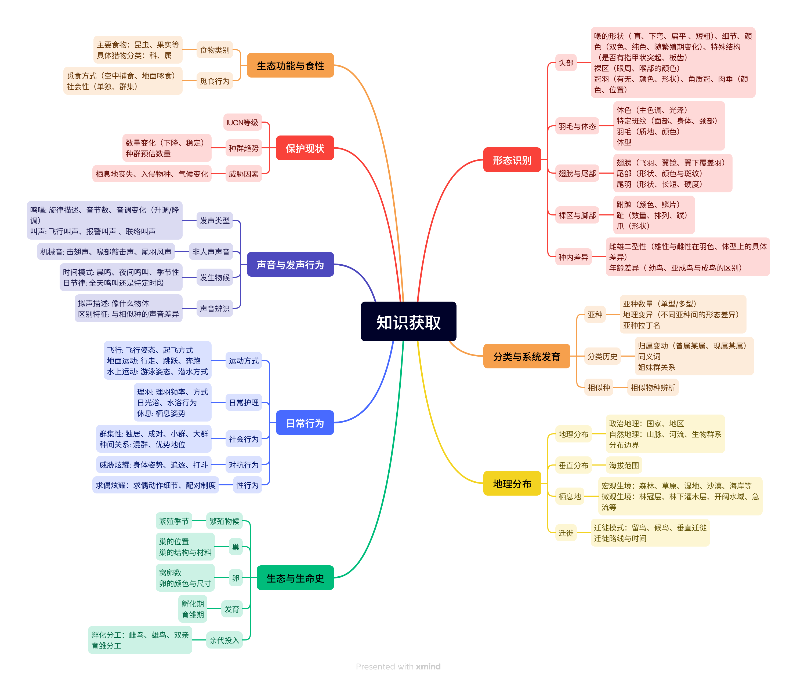
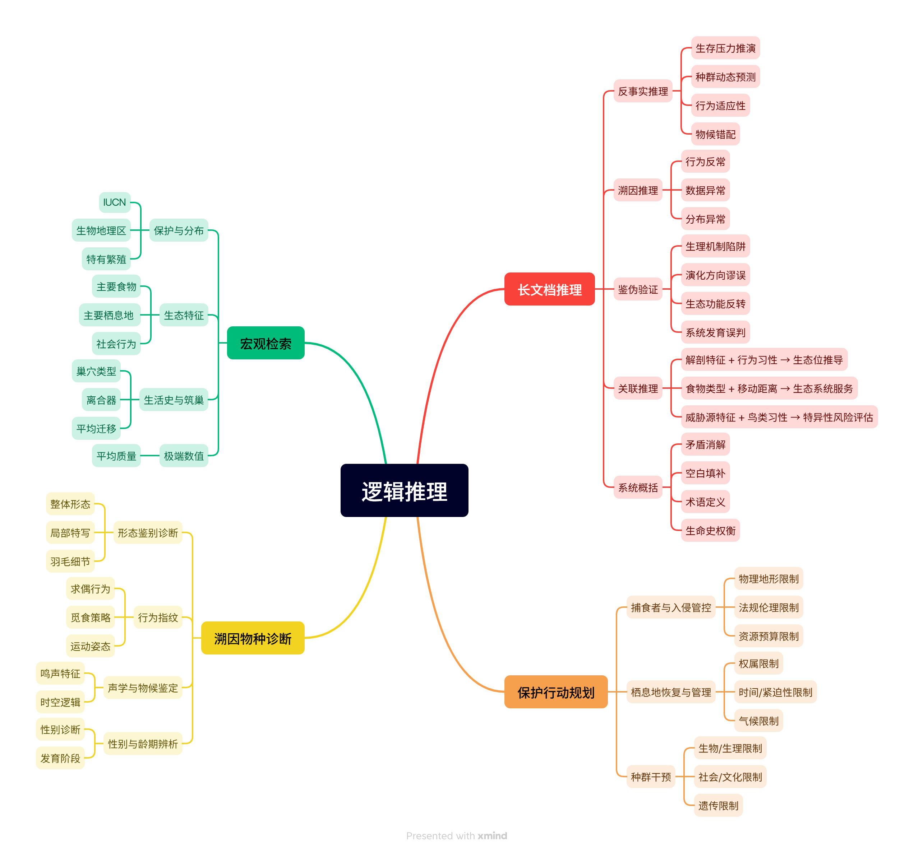

# Orniscient

**Orniscient** 是一个面向鸟类生态知识推理的异构 Benchmark 与知识增强评测框架。它结合 **14 个任务型数据集**、**多源鸟类知识库** 和统一的 **知识增强 Harness**，用于研究：

> **多源鸟类知识在何种条件下、通过何种方式提升大语言模型在鸟类生态任务中的推理能力？**

**Orniscient = Ornithology + Omniscient**  
目标是构建一个可验证、可追溯、可扩展的鸟类生态知识推理基础设施。

<div align="center">

[中文版本](./README_zh.md)/[English Version](./README.md)

</div>

---

## 项目概览

大语言模型在通用问答中表现较强，但鸟类生态知识具有层级性、动态性、证据依赖性和多源异构性，普通 LLM 容易出现知识过时、事实幻觉、分类混淆和证据不可追溯等问题。

Orniscient 围绕三个核心部分展开：

| 模块 | 作用 |
|---|---|
| **Bird Ecology Benchmark** | 评估 LLM 在事实检索、领域推理、反向物种识别、保护规划和结构化枚举等任务上的能力。 |
| **Multi-source Knowledge Base** | 对齐分类体系、BOW 文本证据、事实级图谱结构和结构化 trait 表格。 |
| **knowledge_RAG Harness** | 在统一评测协议下比较裸模型和知识增强的效果对比。 |

系统整体流程如下：


---

## 为什么选择鸟类生态？

鸟类生态不是普通问答。它需要模型理解分类体系、自然史文本、地理分布、生境、行为、繁殖、迁徙和保护证据。

| 挑战 | 说明 |
|---|---|
| **动态分类体系** | 物种命名、checklist、split/lump 会持续变化。 |
| **层级结构明显** | 鸟类知识天然组织在目、科、属、种、亚种等层级中。 |
| **长文本证据** | 关键信息分散在 BOW 物种和科级长文本记录中。 |
| **多源不一致** | BOW、AviList、Clements 和 trait 数据库可能采用不同分类视角。 |
| **证据可追溯需求** | 专业生态回答需要回到权威来源和原文证据。 |
| **结构化约束** | 全局物种筛选等任务不能只依赖自由生成，需要结构化统计。 |

因此，Orniscient 将鸟类生态作为一个用于研究 **异构科学知识源下 LLM 知识推理能力** 的代表性场景。

---

## 核心贡献

1. **构建 14 个数据集的鸟类生态 Benchmark**  
   覆盖事实回忆、分类学推理、地理分布判断、生态综合、保护分析、反向识别和结构化枚举。

2. **设计多源鸟类知识库原型**  
   通过稳定分类锚点对齐 AviList、Clements、BOW records、BOW chunks、事实证据和结构化 trait 表格。

3. **搭建统一 knowledge_RAG Harness**  
   统一管理题库读取、任务路由、知识检索、模型答题、评分、日志和结果聚合。

4. **进行知识增强对比分析**  
   比较裸模型和知识增强的结果，分析外部知识何时有效、何时失效以及为什么失效。

---

# Benchmark 设计

## 设计原则

Orniscient Benchmark 不是普通题目集合，而是面向鸟类生态推理的异构评测基准。

| 原则 | 说明 |
|---|---|
| **知识覆盖性** | 覆盖分类、形态、分布、生境、行为、繁殖、食性、生态功能和保护状态。 |
| **推理层级性** | 从基础的知识获取扩展到领域综合、多跳推理、保护规划和结构化检索。 |
| **证据可追溯性** | 问题和答案尽可能回溯到权威数据源。 |
| **评价多样性** | 使用自动指标、LLM-as-a-Judge、Recall、Top-k 和层级准确率等评价方式。 |

## 任务分类体系

Orniscient 将鸟类的专业知识划分为两大类别，知识获取和逻辑推理两个不同难度的层级。其中知识获取板块分为形态识别、分类与系统发育、生态功能与食性、保护现状、声音与发声行为、日常行为和生态与生命史八大板块，每个板块下都有关于该领域的相关细节的分支；而逻辑推理则将复杂任务归为四大类，基于长文档推理的多跳推理、溯因推理等，特定条件下制定鸟类保护指南，根据掩码描述反向识别物种以及多条件下的宏观检索。




根据不同任务的难易程度以及考察模型的能力，Orniscient 将 14 个数据集划分为三层能力：

1. **Level 1：事实知识检索**  
   考察模型对鸟类物种、科级类群、属性、生境、行为和保护状态等基础事实的掌握，对应鸟类知识体系知识获取里的八大板块。

2. **Level 2：领域推理与综合分析**  
   考察模型对分类学、地理分布、生态功能、保护状态、生活史和相似种比较等领域知识的归纳、比较和解释能力，对应知识获取导图中对应的其中一个板块的知识，并且考察的内容会比Level 1更为深入，涉及到分支细节。

3. **Level 3：复杂推理与结构化检索**  
   考察反向识别、多跳推理、约束规划和全局物种集合枚举，对应鸟类知识体系里的逻辑推理层级。

## Dataset 总览

| 数据集 | 子任务分类 | 评估层级 | 数据量 | 任务描述 | 知识领域 | 数据构建方法 | 评测指标 |
| --- | ---: | ---: | ---: | ---: | ---: | ---: | ---: |
| QA-SC | | L1 | 2400 | 单选题 (1选4)： 从四个选项中选择唯一正确的属性（如体重、体长、IUCN保护等级），评估模型对基础事实的检索能力。 | 基础属性 | 基于BOW与SciQ，按鸟类科级分层程序化抽取题目 | Accuracy |
| QA-MC | | L1 | 1200 | 多选题 (多选)： 从多个选项中选出所有正确的描述，评估模型的综合信息验证能力。 | 食性与栖息地 | 基于BOW由LLM生成多项选择题 | EM / F1 |
| QA-SA | | L1 | 1200 | 简答题： 不提供选项，要求模型直接输出具体的实体名称或数值，评估模型的精准抽取能力。 | 形态学与冷知识 | 从BOW、SciQ与TriviaQA中抽取特定实体和数值信息构建的关键词短答题 | EM / F1 |
| Bird-Geo | 地理分布与时空 | L2 | 400 | 要求模型理解物种跨大洲的分布、特定栖息地偏好及季节性迁徙模式，评估空间推理与时空逻辑能力。 | 分布与栖息地 | 基于BOW并采用程序化地理干扰项生成的题目 | Accuracy |
| Bird-Taxonomy | 鸟类分类学 | L2 | 800 | 基于单型种、亚种变迁、过时名称或命名法与词源学生成判断题，检测模型对过时生物学知识的“幻觉”与盲从程度。 | 分类与系统发育 | 基于BOW中历史分类陷阱与单型种标记构造的问题 | Accuracy |
| Bird-Classify | 层级分类推理 | L2 | 500 | 给定隐去物种名的形态或行为描述，要求模型将其准确归入相应的生物分类“目”或“科”，评估层级分类推理能力。 | 形态、生态与行为 | 基于BOW综合生成的匿名化科级特征描述 | Accuracy / LLM-Eval |
| Bird-Comp | 形态对比分析 | L2 | 1000 | 要求模型区分相似物种，并明确指出亚种或近缘姐妹种之间的具体形态和习性差异，测试比较推理能力。 | 相似种与亚种 | 从BOW的显式相似物种中抽取对比性特征摘要 | LLM-Eval |
| Bird-Life | 生态与生命史 | L2 | 400 | 评估模型是否理解不同鸟类的完整繁殖周期、亲代育雏分工以及各发育阶段的特征。 | 繁殖与生命史 | 基于BOW、ARC与OBQA构建的按时间顺序组织的繁殖时间线任务 | LLM-Eval |
| Bird-Con | 保护现状评估 | L2 | 200 | 要求模型识别主要人为威胁因素及外来入侵物种对特定物种的影响，评估模型的风险评估与归纳能力。 | 保护与栖息地 | 从BOW与ARC中抽取的匿名化威胁因素摘要 | Recall / Accuracy |
| Bird-Eco | 生态功能推理 | L2 | 200 | 要求模型分析鸟类在当地生态系统中的角色，及其局部灭绝可能导致的营养级联后果，评估生态功能推理。 | 食性与栖息地 | 基于BOW与ARC构建的从食性到生态功能映射的推理链任务 | LLM-Eval |
| Bird-ID | 溯因物种诊断 | L3 | 1000 | 要求模型仅凭一段深度脱敏的形态或行为描述文本，逆向确诊出唯一的目标物种，评估溯因识别能力。 | 识别与行为特征 | 基于BOW与CUB综合生成并去地理化处理的诊断性描述 | Top-5 准确率 |
| Bird-Reason | 长文本逻辑推理 | L3 | 200 | 输入完整的物种志长文档，要求模型回答需要跨段落整合的复杂问题（如归因、纠错、多跳），评估长文档推理。 | 复杂逻辑推理 | 基于BOW构建并注入逻辑谬误的全文匿名化物种专论 | LLM-Eval |
| Bird-Plan | 保护规划制定 | L3 | 100 | 输入濒危物种数据，要求模型在被系统注入的严苛现实约束条件（如预算不足、地形受限）下，生成针对性的保护行动计划书。 | 保护规划与战略 | 基于BOW中濒危物种档案并注入显式约束条件构建的保护规划任务 | LLM-Eval |
| List-Global | 宏观条件检索 | L3 | 200 | 评估模型在跨地域、跨物种、多重属性条件交集（如食性+迁徙+等级）下的大规模全局数据综合检索能力。 | 全局数据综合 | 基于BIRDBASE使用多条件DataFrame逻辑程序化筛选生成的物种列表 | Recall / Accuracy |

## Benchmark 构建流程

Orniscient 围绕 BOW、SciQ、TriviaQA、ARC、OBQA、CUB 与 BIRDBASE 等数据源构建题目，并采用任务模板约束题目构造：对于 QA-SC、QA-SA、Bird-Geo 和 List-Global 等可程序化生成或校验的任务，系统优先使用规则或表格逻辑生成题目与标准答案；对于 Bird-Comp、Bird-Life、Bird-Eco、Bird-Con、Bird-Reason 和 Bird-Plan 等开放生成任务，则在明确任务模板、输入约束和参考证据的基础上进行 LLM 辅助生成。

在答案处理上，客观题和结构化任务会进行答案规范化，例如选项标准化、关键词归一、物种名匹配和列表去重；开放生成任务则保留参考答案、证据摘要或评价维度，用于后续 LLM-as-a-Judge。对于依赖外部知识的题目，系统尽量保留可回溯的数据来源、目标实体和证据片段，使 Benchmark 不只是题目集合，而是能够支持知识增强检索和 bad case 定位的评测资源。

其中，LLM-as-a-Judge 主要用于难以用精确匹配评价的开放生成任务。评测时，Judge 会根据参考答案、关键事实、证据覆盖、逻辑一致性和任务完成度等维度进行打分，而不是只判断表面文本相似度。对于 Bird-ID 和 List-Global 等结构化任务，系统更关注候选集合是否包含正确答案、输出列表是否完整，以及分类层级是否匹配。

---

# 知识库设计

## 设计动机

单一固定 RAG 流程难以稳定支持所有鸟类生态任务。鸟类知识同时具有 **分类层级结构**、**长文本自然史证据**、**事实条件限定** 和 **结构化 trait 约束**：例如 Bird-Life 与 Bird-Con 需要从 BOW 长文本中归纳证据，Bird-Taxonomy 需要可靠的分类层级和 checklist 对齐，Bird-ID 需要候选物种召回，List-Global 则更依赖表格过滤而不是自由生成。

因此，Orniscient 采用多源知识设计，将文本、表格和图谱分工组织，而不是把所有信息压缩进单一向量库。

| 知识源 | 作用 |
|---|---|
| **AviList** | 构建规范分类主树，作为 canonical taxonomy backbone |
| **Clements Checklist** | 作为 Cornell/BOW-compatible 兼容层，处理 checklist 差异 |
| **Birds of the World (BOW)** | 提供物种和科级自然史长文本证据 |
| **BIRDBASE-style trait tables** | 提供结构化 trait 过滤和多条件约束 |
| **Fact graph** | 将物种、事实、证据和文本块连接起来，支持可追溯检索 |
| **Vector index** | 对文本块和事实描述进行语义召回 |

专业领域知识通常不是纯文本，也不是纯图谱，而是由文本描述、实体关系和结构化属性共同构成。Orniscient 的重点不是“为了有图而建图”，而是研究 **图结构、文本证据和表格约束分别在什么任务上帮助 LLM**。

---

## 知识库总体结构

Orniscient 的知识库由三层组成，其中：

1. **Canonical Taxonomy Backbone** 解决实体锚定问题。所有 record、chunk、fact、evidence 和 trait 都尽量挂接到统一的 `canonical_taxon_id`。
2. **Text Evidence Store** 保留 BOW 的 species/family record 和章节化 chunk，用于开放生成和证据追溯。
3. **Fact Graph + Table KB** 将可结构化的事实、证据、trait 和限定条件组织成可查询路径，用于任务感知检索。


---

## 分类体系对齐

知识库构建的第一步是建立稳定分类锚点。Orniscient 使用 AviList 作为规范分类主树，并使用 Clements 作为 Cornell/BOW-compatible 兼容层。

通过`canonical_taxon_id` 唯一标识同一实体，将 BOW record、文本 chunk、Fact、Evidence、图谱节点和表格属性挂接到同一分类实体上，解决了多源不一致问题，减少同物异名、旧名称、split/lump 变化和不同 checklist 之间的错配。

### 分类主树示例

下面的图展示了 AviList 规范分类主树中 Accipitriformes 的局部结构。它说明系统如何从 order 层级向下连接 family、genus 和 species。Orniscient 中已给出可视化分类主树的脚本，`Orniscient/scripts/render_taxonomy_subtree.py`可自行查阅。


### Checklist Crosswalk 示例

下面的图展示了 AviList canonical backbone 与 Clements/BOW-compatible 兼容层之间的映射。绿色边表示 exact match，蓝色虚线表示 alias，橙色虚线表示 split/lump drift 等分类差异。


---

## 文本证据库

系统将 BOW 的 species records 和 family records 解析为章节化 chunks。每个 chunk 保留来源章节、子章节、物种名、科名、文件来源和父级 record 信息，实现可追溯。

每个 chunk 的核心字段包括：

```text
chunk_id
canonical_taxon_id
common_name
scientific_name
record_type
source_chapter
source_chapter_raw
source_subchapter
text
```

chunk 不再独立进行分类匹配，而是继承父级 record 的 `canonical_taxon_id`。这样可以避免同一物种下不同 chunk 被错误挂接到其他近缘种或同名实体上，从而减少检索阶段的 taxonomy drift。

---

## Claim–Fact–Evidence–Qualifier 建模

鸟类生态事实往往不是全局成立的。例如某种鸟的栖息地、繁殖行为、迁徙状态、性别差异或保护威胁，可能受到地区、季节、年龄、性别、亚种、种群和不确定性影响。因此，Orniscient 不把 BOW 文本简单压缩成扁平三元组，而是采用四类对象建模：

| 对象 | 作用 |
|---|---|
| `Claim` | 从 chunk 中抽取的自然语言断言，尽量保留原文语义 |
| `Fact` | 经过规范化的事实节点，用于检索、比较和聚合 |
| `Evidence` | 支撑 claim 或 fact 的原文证据片段 |
| `Qualifier` | 描述事实成立条件的限定信息，例如地区、季节、性别、年龄、亚种、时间、不确定性和适用范围 |

这一设计的目标是让知识库同时支持两类需求：一方面，模型可以获得自然语言上下文；另一方面，系统可以沿结构化路径定位事实和证据。

---

## 图谱 Schema

核心图谱路径为：

```text
Taxon → Fact → Evidence → Chunk
```

该路径体现了知识增强检索中的基本逻辑：

1. 先通过题目中的目标实体定位 `Taxon`；
2. 再根据任务类型选择相关 `Fact`；
3. 通过 `Evidence` 回到原文片段；
4. 最后将对应 `Chunk` 或 evidence span 组织为模型上下文。

可扩展关系包括：

```text
Taxon → ParentTaxon
Taxon → Trait
Taxon → Alias
Taxon → ChecklistEntry
Fact → Qualifier
Fact → Evidence
Evidence → Chunk
```

这种 schema 的设计动机是把三类信息连接起来：

| 信息类型 | 图谱中的表示 | 解决的问题 |
|---|---|---|
| 分类层级 | `Taxon → ParentTaxon` | 支持 order/family/genus/species 层级推理 |
| 文本证据 | `Fact → Evidence → Chunk` | 支持事实追溯和上下文构造 |
| 结构化属性 | `Taxon → Trait` | 支持 List-Global、Bird-ID 等约束检索 |
| checklist 差异 | `Taxon → Alias / ChecklistEntry` | 支持旧名、异名和 split/lump 兼容 |

---

## 知识图谱构建流程

Orniscient 首先使用 AviList 构建规范分类主树，并通过 Clements 兼容 Cornell/BOW 体系，得到稳定的 canonical_taxon_id。这一层用于解决同物异名、分类变动和不同 checklist 之间的对齐问题。

随后，Orniscient 将 BOW 中的 species records 和 family records 挂接到对应的 canonical_taxon_id，再按照 BOW 原始章节结构切分为 chunks。chunk 继承父级 record 的分类锚点，从而避免每个 chunk 独立匹配时产生分类漂移。

在事实抽取阶段，Orniscient 从 chunk 中抽取 Claim，并进一步规范化为 Fact，同时保留支撑事实的 Evidence 和描述事实成立条件的 Qualifier。这样可以避免将鸟类生态知识简单压缩为无来源、无条件限定的扁平三元组。

最后，Orniscient 将 Taxon、Fact、Evidence、Chunk 和 Trait 等对象物化为图谱节点和关系，并进行 schema 校验、孤立节点检测、fact-evidence 回链检查和证据可追溯性检查。通过校验后的图谱接入 Neo4j、向量索引和表格知识库，用于后续知识增强检索。

---

### 当前核心 Claim–Fact–Evidence 图谱规模

在最终 V3 Claim–Fact–Evidence 构建阶段，Orniscient 共处理 **309,369 个已对齐的章节化 BOW chunks**，形成 **921,161 条正式 Claims**。随后，系统在全局范围内对同一 taxon 下的语义等价 Claims 进行规范化归并，构建出 **891,862 个 Facts**、**815,896 条 Evidence 记录**以及 **915,793 条 Fact–Evidence Links**。基于 `Taxon → Fact → Evidence → Chunk` 的核心链路，当前待物化核心图谱规模约为 **2,028,249 个核心节点**和 **2,623,551 条核心边**。

Orniscient 的图谱层并不试图把 BOW 长文本完整塞入图数据库。图谱中的 Fact 与 Evidence 主要承担结构化索引、证据锚定和可追溯定位的作用；开放生成任务所需的大段自然语言上下文仍由本地 chunk store / vector index 提供。换言之，图谱负责回答“应该去哪里找、依据哪类事实找”，向量库和 chunk store 负责提供“用于生成回答的长文本内容”。

#### Overall Artifact Scale

| Metric | Count |
| --- | ---: |
| Processed BOW chunks | 309,369 |
| Species claims | 912,598 |
| Family claims | 8,563 |
| Total claims | 921,161 |
| Species facts | 883,500 |
| Family facts | 8,362 |
| Total facts | 891,862 |
| Evidences | 815,896 |
| Fact-Evidence links | 915,793 |
| Supplement accepted claims | 331,827 |
| Supplement covered chunks | 93,542 |
| Hit soft-cap chunks | 33,211 |
| Fact ID collisions | 0 |
| Extractor failures | 0 |

#### Core Graph Size Estimate

| Node Label | Count |
| --- | ---: |
| Taxon | 11,122 |
| Fact | 891,862 |
| Evidence | 815,896 |
| Chunk | 309,369 |
| Total core nodes | 2,028,249 |

| Concept Edge Type | Relation Name | Count |
| --- | --- | ---: |
| Taxon -> Fact | HAS_FACT | 891,862 |
| Fact -> Evidence | SUPPORTED_BY | 915,793 |
| Evidence -> Chunk | FROM_CHUNK | 815,896 |
| Total core edges |  | 2,623,551 |

#### Claim 补充抽取策略验证

为缓解早期 per-chunk Claim 数量上限带来的召回损失，Orniscient 对达到旧抽取上限的高风险 chunks 进行了补充抽取策略验证。系统首先识别出 **93,542 个 at/over-cap chunks**，并在小样本上比较不同 supplementary extraction budget 对 Claim 质量的影响。

| Comparison | Faithfulness | Novelty | Non-duplicate | Atomicity | Predicate/domain fit | Practical usefulness | Overall pass | Near-duplicate |
|---|---:|---:|---:|---:|---:|---:|---:|---:|
| max=6 | 97.27% | 94.55% | 95.45% | 97.27% | 96.97% | 89.09% | 88.18% | 6.06% |
| 12-extra | 93.01% | 65.50% | 65.94% | 92.14% | 97.38% | 55.46% | 53.28% | 36.24% |
| 6+6 Round2 | 98.37% | 75.92% | 76.33% | 95.10% | 99.59% | 73.88% | 71.43% | 35.51% |

实验结果表明，单轮 `max=12` 虽然能够继续产生额外 Claims，但第 7–12 条的新增性、非重复性和实际可用性明显下降。`6+6 Round2` 相比 `12-extra` 更稳定，但第二轮仍存在较高近重复风险；在 55 个样本中，Round2 产生 245 条新增 Claims，51/55 个 chunks 仍有新增，31/55 个 chunks 再次触顶。

因此，最终全量补充抽取采用 **single-pass additional-6** 策略：即每个高风险 chunk 最多补充 6 条高价值 Claims，不执行 Round2 continuation。最终，系统将 **331,827 条 supplementary claims** 合入 Claim v2，并将 **33,211 个 hit soft-cap chunks** 保留为后续高召回扩展清单。

#### V3 事实抽取规模与知识覆盖

在 V3 事实图谱构建阶段，Orniscient 以章节化 BOW chunks 为基本输入，执行  
`Chunk → Claim → Fact → Evidence → Fact–Evidence Link` 的抽取与规范化流程，并且可以追溯到具体的 chunk。

#### Fact 领域划分与受控关系模式
为保证事实抽取结果具有一致的语义结构、可比较性和可追溯性，Orniscient 在 Step 3 中没有直接让 LLM 自由生成开放三元组，而是采用了受控事实领域（controlled fact domains）与受控谓词集合（controlled predicates）的设计,将鸟类自然史知识划分为 8 个核心事实领域，并为每个领域预定义可用的关系类型，从而约束抽取结果的语义空间，减少模式漂移和表述碎片化问题。

当前 schema 包含 8 个 fact domains 和 74 个 controlled predicates。Predicate Count 表示该 fact domain 下受控谓词类型数量。表中 Controlled Predicates 为完整 schema 列表，而不是频次统计：

| Fact Domain | Predicate Count | Controlled Predicates |
| --- | ---: | --- |
| TaxonomyAndPhylogeny | 8 | `HAS_SUBSPECIES`, `HAS_GEOGRAPHIC_VARIATION`, `HAS_SUBSPECIES_TRAIT`, `HAS_SUBSPECIES_DISTRIBUTION`, `HYBRIDIZES_WITH`, `RELATED_TO`, `HAS_CLASSIFICATION_HISTORY`, `HAS_TAXONOMIC_NOTE` |
| MorphologyAndIdentification | 13 | `HAS_BODY_LENGTH`, `HAS_BODY_MASS`, `HAS_WING_LENGTH`, `HAS_TAIL_LENGTH`, `HAS_BILL_LENGTH`, `HAS_TARSUS_LENGTH`, `HAS_WINGSPAN`, `HAS_PLUMAGE_TRAIT`, `HAS_MOLT_PATTERN`, `HAS_SEXUAL_DIMORPHISM`, `HAS_AGE_DIMORPHISM`, `HAS_DIAGNOSTIC_TRAIT`, `HAS_STRUCTURE_TRAIT` |
| DistributionAndMovement | 8 | `OCCURS_IN`, `ENDEMIC_TO`, `BREEDS_IN`, `WINTERS_IN`, `MIGRATES_VIA`, `HAS_MIGRATION_PATTERN`, `HAS_ELEVATION_RANGE`, `HAS_DISTRIBUTION_NOTE` |
| Habitat | 2 | `INHABITS_BIOME`, `USES_MICROHABITAT` |
| EcologyAndDiet | 5 | `EATS_CATEGORY`, `EATS_ITEM`, `FORAGES_BY`, `FORAGES_IN_STRATUM`, `HAS_ECOLOGICAL_ROLE` |
| VocalAndBehavior | 18 | `HAS_VOCALIZATION_TYPE`, `CALLS_DURING`, `HAS_NONVOCAL_SOUND`, `HAS_SOUND_DIAGNOSTIC`, `HAS_SOCIAL_BEHAVIOR`, `HAS_TERRITORIAL_BEHAVIOR`, `HAS_LOCOMOTION_STYLE`, `HAS_FLIGHT_ABILITY`, `HAS_RUNNING_SPEED`, `HAS_JUMP_HEIGHT`, `HAS_SWIMMING_ABILITY`, `HAS_CLIMBING_ABILITY`, `HAS_DAILY_ACTIVITY_PATTERN`, `HAS_COURTSHIP_BEHAVIOR`, `HAS_MATING_SYSTEM`, `HAS_PAIR_BOND`, `HAS_COPULATION_BEHAVIOR`, `HAS_AGONISTIC_BEHAVIOR` |
| LifeHistoryAndBreeding | 10 | `BREEDS_DURING`, `NESTS_AT`, `HAS_NEST_STRUCTURE`, `HAS_EGG_TRAIT`, `HAS_CLUTCH_SIZE`, `HAS_INCUBATION_PERIOD`, `HAS_FLEDGING_PERIOD`, `HAS_PARENTAL_ROLE`, `HAS_DEVELOPMENT_NOTE`, `HAS_DEMOGRAPHIC_NOTE` |
| ConservationAndResearch | 10 | `HAS_IUCN_STATUS`, `HAS_POPULATION_TREND`, `THREATENED_BY`, `HAS_CONSERVATION_ACTION`, `INTERACTS_WITH_HUMANS`, `HAS_PREDATOR`, `HAS_PARASITE`, `HAS_DISEASE`, `HAS_MORTALITY_CAUSE`, `REQUIRES_RESEARCH_ON` |


在这一框架下，每条 Fact 不仅包含主体、谓词和客体，还会被显式赋予所属领域，并通过 Fact → Evidence → Chunk 链接回原始 BOW 文本片段，这种设计使得知识图谱既保留了细粒度生态事实，又具备稳定的统计分析能力和可复现的知识增强接口。

##### 高频 Fact Predicate 分布

下表展示了当前抽取结果中出现频率最高的一组事实关系。可以看到，图谱不仅覆盖分布、生境、保护状态等基础知识，也覆盖鸣声、亲代行为、巢结构、卵特征、迁徙模式和数量性表型等细粒度生态事实。针对不同类型的问题，可以直接定位到相关类型的Fact节点获取关键信息，再一路追溯到相关文本片段，实现可追溯。


| Predicate | Fact Count |
|---|---:|
| HAS_PLUMAGE_TRAIT | 88,726 |
| INHABITS_BIOME | 61,235 |
| OCCURS_IN | 49,913 |
| EATS_ITEM | 49,404 |
| HAS_VOCALIZATION_TYPE | 42,121 |
| HAS_SUBSPECIES | 31,396 |
| THREATENED_BY | 21,709 |
| HAS_NEST_STRUCTURE | 20,342 |
| HAS_DIAGNOSTIC_TRAIT | 19,945 |
| EATS_CATEGORY | 19,633 |
| HAS_PARENTAL_ROLE | 19,075 |
| FORAGES_IN_STRATUM | 18,980 |
| HAS_POPULATION_TREND | 18,817 |
| FORAGES_BY | 18,706 |
| HAS_STRUCTURE_TRAIT | 17,377 |
| HAS_SEXUAL_DIMORPHISM | 16,829 |
| HAS_BODY_LENGTH | 16,534 |
| BREEDS_DURING | 16,496 |
| HAS_BODY_MASS | 15,763 |
| HAS_DISTRIBUTION_NOTE | 15,370 |
| HAS_IUCN_STATUS | 15,166 |
| RELATED_TO | 14,646 |
| HAS_MIGRATION_PATTERN | 14,634 |
| HAS_DEMOGRAPHIC_NOTE | 13,663 |
| NESTS_AT | 13,002 |
| HAS_CONSERVATION_ACTION | 12,263 |
| USES_MICROHABITAT | 12,021 |
| HAS_TAXONOMIC_NOTE | 11,924 |
| HAS_MOLT_PATTERN | 11,839 |
| HAS_CLUTCH_SIZE | 11,635 |

#### Fact 领域分布

V3 事实图谱的抽取结果覆盖鸟类生态知识的多个主要维度。  
其中，形态与识别、繁殖与生命史、分布与迁徙、生态与食性、保护研究等领域均形成了较大规模的事实节点，说明图谱并非仅围绕某一类浅层属性构建，而是对 BOW 自然史文本进行了多维知识组织。


| Fact Domain | Fact Count | Share |
|---|---:|---:|
| MorphologyAndIdentification | 217,286 | 24.36% |
| LifeHistoryAndBreeding | 137,996 | 15.47% |
| EcologyAndDiet | 120,624 | 13.53% |
| DistributionAndMovement | 102,493 | 11.49% |
| ConservationAndResearch | 85,579 | 9.60% |
| TaxonomyAndPhylogeny | 77,600 | 8.70% |
| VocalAndBehavior | 76,755 | 8.61% |
| Habitat | 73,529 | 8.24% |

---

## 可视化与定性分析

Orniscient 使用三类可视化来展示知识库构建结果：

| 可视化 | 内容 | 作用 |
|---|---|---|
| Taxonomy Tree | 展示 AviList canonical backbone 的局部树结构 | 说明分类主树如何组织 order/family/genus/species |
| Checklist Crosswalk | 展示 AviList 与 Clements/BOW-compatible 层之间的映射 | 说明 exact match、alias、split/lump drift 等兼容关系 |
| KG Subgraph | 展示目标物种周围的 Fact、Evidence、Chunk 邻域 | 说明图谱如何支持证据追溯和任务感知检索 |

其中，taxonomy tree 更适合展示分类骨架，crosswalk 更适合展示多 checklist 对齐，KG subgraph 更适合展示图谱如何服务 RAG。

---

## 如何可视化分类树？

如果想要把鸟类分类骨架可视化为树，建议不要直接画全量节点，全量树会过大，难以阅读。本文也提供了可视化脚本以供使用：

1. 选择一个 order 或 family 作为根节点，例如 `Accipitriformes`；
2. 从 `canonical_taxon_nodes.jsonl` 和 `canonical_taxon_edges.jsonl` 中读取节点和父子边；
3. 按 rank 设置不同颜色或形状；
4. 只保留局部子树，例如 order → family → genus → species；
5. 输出为 `.png`、`.svg` 或 `.dot`，放入 `docs/assets/`。

推荐输出：

```text
docs/assets/taxonomy_tree_accipitriformes.png
docs/assets/checklist_crosswalk_accipitriformes.png
docs/assets/kg_subgraph_example.png
```


---


# 知识增强 Harness

知识增强 Harness 统一管理评测流程：题库读取 → 任务路由 → 知识模式选择 → 检索 / 查询 → 上下文构造 → LLM 答题 → 评分 / Judge → 聚合与分析

支持勾选单个或多个数据集，以及Zero-shot、Few-shot、CoT三种思考模式，在none（裸模型）和hybrid（知识增强）的配置上进行测试。

Harness 会记录运行清单、上下文日志、模型回答、judge 结果、聚合结果和 bad case 日志，用于复现和诊断。

---

# 实验与分析

## 实验设置

Orniscient 在相同题库、提示词、模型和评分脚本下比较裸模型与知识增强模型。实验目标不是简单证明“知识增强一定提升”，而是分析 **外部知识在什么任务上有效、在什么任务上失效，以及失效原因来自检索、证据组织、任务约束还是模型利用证据的能力**。

| 设置 | 说明 |
|---|---|
| Vanilla | 不接入外部知识 |
| Text-RAG | 接入 BOW 文本 chunks |
| KG-RAG v1 | 接入早期图谱检索 |
| KG-RAG v3 | 接入 Taxon–Fact–Evidence 图谱 |
| Hybrid KG-RAG | 融合图谱、文本、表格和 reranker |

Prompt 设置包括：

| 模式 | 说明 |
|---|---|
| Zero-shot | 直接回答 |
| Few-shot | 提供示例回答 |
| CoT | 推理式提示 |

> 注：以下结果单位均为百分比（%）。Bird-Classify Type1 表示给定 family 或 taxon 后生成特征细节的开放式任务；Type2 表示根据描述识别 order/family 的结构化分类任务。符号 `--` 表示该模式下未单独设置对应评测。

---

## 实验结果

### 裸模型结果

#### 客观题得分

| Model | QA-SC | QA-MC (EM/F1) | QA-SA | Bird-Geo | Bird-Taxonomy (EM/F1) |
|---|---:|---:|---:|---:|---:|
| DeepSeek-V3.2 | 78.61 | 38.62 / 83.59 | 13.77 | 90.62 | 20.48 / 40.23 |
| qwen3-max | 75.12 | 45.12 / 85.22 | 11.28 | 87.47 | 19.05 / 36.52 |
| glm-5 | 42.98 | 1.28 / 72.31 | 11.61 | 46.00 | 27.65 / 34.87 |
| doubao-seed-2-0-pro-260215 | 84.29 | 50.69 / 88.79 | 16.11 | 91.74 | 20.00 / 38.70 |
| hunyuan-turbos-latest | 73.06 | 27.85 / 77.62 | 11.59 | 82.14 | 23.64 / 40.75 |
| ernie-4.5-turbo-128k | 72.49 | 31.66 / 78.54 | 9.02 | 81.54 | 13.19 / 33.21 |
| MiniMax-M2.7 | 16.33 | 2.19 / 75.64 | 22.41 | 24.33 | 5.36 / 39.14 |

裸模型在客观题上表现出明显的模型差异。DeepSeek、qwen、doubao 和 hunyuan 在 QA-SC 与 Bird-Geo 上表现较强，说明这些模型具备较好的基础事实判断和常见分布知识；但 QA-SA 与 Bird-Taxonomy 的整体得分偏低，说明短答生成和分类学精确匹配仍然困难。MiniMax-M2.7 在 QA-SA 上较高，但在 QA-SC 与 Bird-Geo 上明显偏低，说明不同模型的能力边界并不一致。

#### 主观题与结构化任务得分

| Model | Bird-Classify Type1 | Bird-Classify Type2 | Bird-Life | Bird-Eco | Bird-Con | Bird-Comp | Bird-Reason | Bird-ID | List-Global | Bird-Plan |
|---|---:|---:|---:|---:|---:|---:|---:|---:|---:|---:|
| DeepSeek-V3.2 | 61.37 | 86.83 | 23.47 | 33.51 | 33.77 | 31.35 | 84.51 | 26.71 | 8.20 | 94.32 |
| DeepSeek-V3.2 with Few-shot | 63.65 | -- | 24.86 | 44.19 | 40.58 | 31.76 | 82.50 | 18.99 | 7.13 | 93.92 |
| DeepSeek-V3.2 with CoT | 61.30 | -- | 28.78 | 36.03 | 36.80 | 28.24 | 84.19 | 32.12 | 14.33 | 92.97 |
| glm-5 | 59.21 | 100.00 | 9.31 | 16.33 | 22.08 | 35.31 | 70.15 | 12.97 | 3.27 | 96.88 |
| glm-5 with Few-shot | 62.00 | -- | 40.99 | 45.65 | 27.96 | 21.67 | 70.36 | 17.58 | 4.77 | 95.02 |
| glm-5 with CoT | 59.02 | -- | 9.38 | 29.38 | 23.82 | 31.67 | 84.17 | 13.56 | 6.64 | 98.12 |
| doubao-seed-2-0-pro | 64.06 | 94.61 | 15.95 | 36.08 | 24.78 | 29.05 | 84.86 | 42.93 | 9.41 | 98.87 |
| doubao-seed-2-0-pro with Few-shot | 64.58 | -- | 17.30 | 39.59 | 21.34 | 25.68 | 77.70 | 33.64 | 7.89 | 98.33 |
| doubao-seed-2-0-pro with CoT | 63.26 | -- | 14.86 | 33.73 | 24.42 | 26.62 | 84.19 | 48.89 | 19.61 | 99.09 |
| hunyuan-turbos-latest | 64.91 | 81.74 | 25.41 | 41.35 | 21.48 | 30.95 | 81.57 | 8.28 | 9.50 | 97.03 |
| hunyuan-turbos-latest with Few-shot | 73.05 | -- | 20.68 | 48.46 | 31.62 | 26.62 | 80.73 | 13.56 | 9.29 | 96.08 |
| hunyuan-turbos-latest with CoT | 64.13 | -- | 26.89 | 44.32 | 22.11 | 32.84 | 80.24 | 17.58 | 11.70 | 94.05 |
| ernie-4.5-turbo-128k | 65.04 | 100.00 | 34.61 | 35.45 | 28.48 | 29.33 | 86.60 | 34.62 | 29.61 | 98.12 |
| ernie-4.5-turbo-128k with Few-shot | 70.94 | -- | 20.91 | 31.11 | 30.47 | 23.33 | 79.81 | 33.01 | 29.01 | 99.09 |
| ernie-4.5-turbo-128k with CoT | 63.49 | -- | 31.25 | 27.78 | 30.58 | 31.06 | 83.92 | 35.64 | 33.33 | 95.28 |
| MiniMax-M2.7 | 87.27 | 69.64 | 90.27 | 83.78 | 88.24 | 97.57 | 94.73 | 3.19 | 1.28 | 96.31 |
| MiniMax-M2.7 with Few-shot | 62.88 | -- | 23.78 | 40.61 | 35.28 | 31.22 | 78.41 | 9.90 | 1.04 | 96.62 |
| MiniMax-M2.7 with CoT | 83.68 | -- | 92.57 | 80.41 | 91.76 | 76.22 | 92.03 | 4.91 | 1.12 | 96.98 |

裸模型在主观题与结构化任务上呈现出更强的任务差异。MiniMax-M2.7 在 Bird-Life、Bird-Eco、Bird-Con 和 Bird-Comp 等开放生成任务上表现突出，但在 Bird-ID 和 List-Global 上得分较低，说明开放生成能力强并不等价于结构化检索能力强。Bird-ID 和 List-Global 整体较难，反映出反向识别与全局集合枚举不能仅依赖模型参数记忆和自由生成。

---

### 知识增强结果

#### 客观题得分

| Model | QA-SC | QA-MC | QA-SA | Bird-Geo | Bird-Taxonomy (EM/F1) |
|---|---:|---:|---:|---:|---:|
| DeepSeek-V3.2 | 90.82 | 88.93 | 25.81 | 97.77 | 22.00 / 44.13 |
| qwen3-max | 90.59 | 82.66 | 24.66 | 97.97 | 18.00 / 41.38 |
| glm-5 | 47.65 | 0.34 | 24.13 | 62.96 | 10.64 / 37.40 |
| doubao-seed-2-0-pro-260215 | 95.00 | 79.58 | 18.41 | 98.46 | 20.00 / 41.47 |
| hunyuan-turbos-latest | 88.29 | 82.24 | 23.79 | 97.32 | 24.00 / 40.80 |
| ernie-4.5-turbo-128k | 23.33 | 0.47 | 24.06 | 26.00 | 26.40 / 39.21 |
| MiniMax-M2.7 | 46.33 | 76.70 | 24.88 | 55.00 | 8.00 / 37.37 |

知识增强在客观题上的效果具有明显任务相关性。QA-SC、QA-SA 和 Bird-Geo 中，多数模型获得提升，说明外部文本证据和结构化知识可以补充模型参数化知识不足。QA-MC 和 Bird-Taxonomy 则更不稳定：多选题容易受到候选边界和干扰证据影响，分类学任务则依赖 taxonomy 对齐、名称规范化和输出格式控制。因此，知识增强不是简单扩大上下文，而是需要更精确的检索、章节过滤和答案约束。

#### 主观题与结构化任务得分

| Model | Bird-Classify Type1 | Bird-Classify Type2 | Bird-Life | Bird-Eco | Bird-Con | Bird-Comp | Bird-Reason | Bird-ID | List-Global | Bird-Plan |
|---|---:|---:|---:|---:|---:|---:|---:|---:|---:|---:|
| DeepSeek-V3.2 | 77.61 | 98.20 | 87.08 | 91.01 | 92.59 | 81.16 | 95.67 | 40.71 | 70.30 | 97.54 |
| DeepSeek-V3.2 with Few-shot | 76.23 | -- | 87.95 | 92.90 | 93.44 | 83.35 | 97.25 | 38.48 | 72.15 | 96.16 |
| DeepSeek-V3.2 with CoT | 76.71 | -- | 85.64 | 92.69 | 93.09 | 81.27 | 96.11 | 38.60 | 71.75 | 95.48 |
| glm-5 | 81.67 | 100.00 | 87.47 | 95.07 | 93.86 | 88.60 | 97.27 | 70.48 | 72.20 | 97.83 |
| glm-5 with Few-shot | 70.83 | -- | 87.22 | 94.93 | 93.51 | 91.18 | 98.84 | 70.20 | 74.37 | 97.95 |
| glm-5 with CoT | 83.04 | -- | 87.50 | 94.08 | 95.71 | 89.20 | 97.73 | 72.00 | 72.80 | 97.21 |
| doubao-seed-2-0-pro | 84.41 | 98.08 | 86.73 | 95.03 | 94.35 | 82.75 | 98.29 | 35.29 | 76.47 | 98.71 |
| doubao-seed-2-0-pro with Few-shot | 85.88 | -- | 88.53 | 92.70 | 94.03 | 82.27 | 98.44 | 35.29 | 77.74 | 98.73 |
| doubao-seed-2-0-pro with CoT | 83.53 | -- | 86.52 | 93.11 | 94.29 | 82.94 | 98.27 | 33.51 | 72.80 | 98.47 |
| hunyuan-turbos-latest | 76.38 | 97.90 | 87.48 | 94.09 | 95.22 | 80.22 | 97.23 | 42.16 | 65.25 | 98.65 |
| hunyuan-turbos-latest with Few-shot | 76.44 | -- | 86.15 | 91.37 | 94.14 | 78.52 | 97.15 | 44.30 | 68.20 | 98.81 |
| hunyuan-turbos-latest with CoT | 74.53 | -- | 96.71 | 91.97 | 95.04 | 79.96 | 96.11 | 30.72 | 71.75 | 97.70 |
| ernie-4.5-turbo-128k | 73.04 | 100.00 | 89.12 | 92.79 | 91.20 | 84.60 | 98.16 | 18.62 | 70.80 | 97.12 |
| ernie-4.5-turbo-128k with Few-shot | 74.53 | -- | 88.41 | 93.42 | 90.16 | 86.32 | 98.16 | 17.01 | 71.20 | 98.21 |
| ernie-4.5-turbo-128k with CoT | 77.10 | -- | 88.30 | 91.99 | 93.83 | 84.87 | 97.67 | 16.67 | 72.80 | 98.33 |
| MiniMax-M2.7 | 91.27 | 76.47 | 93.30 | 96.04 | 94.48 | 85.99 | 97.08 | 16.62 | 72.80 | 98.49 |
| MiniMax-M2.7 with Few-shot | 81.67 | -- | 89.06 | 92.01 | 95.75 | 88.90 | 98.57 | 15.29 | 67.20 | 98.65 |
| MiniMax-M2.7 with CoT | 89.90 | -- | 90.97 | 92.53 | 95.06 | 84.87 | 98.44 | 29.41 | 70.20 | 99.52 |

知识增强在开放生成任务上带来了最稳定的提升。Bird-Life、Bird-Eco、Bird-Con、Bird-Comp 和 Bird-Reason 普遍达到较高分数，说明当任务需要事实归纳、细节覆盖和证据组织时，外部证据能够显著改善回答质量。结构化任务的提升则更依赖任务路径：List-Global 在知识增强后大幅提升，说明表格过滤和结构化约束对全局集合枚举非常关键；Bird-ID 虽有提升，但仍受候选召回和 reranker 质量限制，不同模型之间差异明显。

---

## 总体分析

### 知识增强何时有效？

从结果看，知识增强主要在三类场景中有效：

1. **目标实体明确且证据可定位的任务**  
   如 QA-SC、QA-SA、Bird-Life 和 Bird-Con。系统可以先定位目标物种或 family，再检索相关 chunk、fact 和 evidence，减少模型凭记忆作答的风险。

2. **需要事实覆盖和细节组织的开放生成任务**  
   主观题普遍受益于外部证据，因为模型需要整合分布、行为、繁殖、食性、保护威胁等多方面信息。知识库提供了更稳定的事实来源。

3. **需要结构化约束的集合任务**  
   List-Global 在知识增强后显著提升，说明这类任务不能依赖自由生成，而应通过 BIRDBASE-style 表格过滤或图谱约束先确定候选集合。

### 知识增强何时失效？

知识增强也可能失效，尤其在以下场景中：

1. **多选题边界不清晰**  
   QA-MC 需要同时判断多个选项，检索到的证据可能支持部分选项，也可能引入干扰信息。

2. **地理分布存在稀有记录或表述歧义**  
   Bird-Geo 中，偶发分布、迁徙范围和地区限定会影响模型判断。长上下文不一定提升可靠性。

3. **候选召回漏掉正确答案**  
   Bird-ID 的核心瓶颈是候选集合是否包含正确物种，若召回阶段失败，后续模型即使推理能力强也难以恢复。

4. **模型证据利用能力较弱**
   在 List-Global 中，存在系统已经筛选出完全正确的物种清单，但是交由模型处理时，模型剔除部分正确物种的情况，导致实际评分降低。

### 图谱为什么能帮助模型？

图谱的价值不在于“把文本换成图”，而在于提供更稳定的知识访问路径：

```text
Taxon → Fact → Evidence → Chunk
```

该路径带来三点优势：

- **实体锚定**：`canonical_taxon_id` 减少同物异名、taxonomy 变动和 checklist 差异造成的错配；
- **证据追溯**：Fact 可以回到 Evidence，再回到原始 Chunk，使回答具备可审计来源；
- **任务感知检索**：不同任务可以选择不同 route，例如目标实体题走 Taxon-Fact-Evidence-chunk，Bird-ID 走候选召回，List-Global 走表格过滤。

因此，Orniscient 的实验结论不是“知识库总能提升模型”，而是：**知识增强效果取决于知识覆盖、检索召回、上下文构造、输出约束和模型证据利用能力。**

### 知识增强案例
这里给出知识增强对于三个不同的模型分别在客观题、主观题和结构化题上带来提升的例子。
#### 案例 1：外部证据纠正客观事实判断错误

> 问题：What is described as the single most important threat to the continued existence of Hawaiian Duck?
> 选项：
> "A": "Habitat loss due to wetland destruction"
> "B": "Predation from introduced mammals"
> "C": "Hybridization with feral Mallards"
> "D": "Sport hunting in the early 20th century"


在 `QA-SC` 数据集的 `qa_sc_0014` 中，题目围绕 **Hawaiian Duck** 的物种事实展开。  
裸模型设置下，Doubao 选择了错误答案 `A`；接入外部知识后，模型改选 `C`，与标准答案一致。

| 设置 | 预测答案 | 是否正确 |
|---|---:|---|
| 裸模型 | A | ✗ |
| 知识增强 | C | ✓ |

知识增强阶段检索到的 BOW 证据指出，Hawaiian Duck 的持续存续受到多重威胁，其中与野化 Mallard 的杂交是其重要甚至关键风险来源。该证据为模型提供了原本参数化记忆中缺失的物种级细节，使其完成了从错误判断到正确判断的修正。

这一案例说明：对于目标实体明确、答案依赖专业事实的客观题，外部知识能够有效补充模型参数化知识的遗漏。

#### 案例 2：结构化题大幅提升
在 `List-Global` 的 `list_global_0197` 中，题目要求找出：

> Which bird species are among the lightest 10% by average mass and are found in the Australian-Indomalayan-West Pacific (AIW) zoogeographic realm?
> 平均体重位于最轻 10%，且分布于 Australian-Indomalayan-West Pacific（AIW）动物地理区的鸟类物种。

标准答案为：

```text
Cisticola exilis
Collocalia esculenta
Cypsiurus balasiensis
```


裸模型huanyuan给出的答案：可以看到，模型其实抓住了要输出“体重最轻的鸟”这个表面意图，但是却没有正确处理 AIW 这个地理条件约束，最终输出与标准答案无一重合，这要暴露出了模型难以完成跨全局多条件的复杂检索任务。
```text
Mellisuga helenae
Colibri thalassinus
Archilochus colubris
Regulus regulus
Calypte anna
Lophornis ornatus
Myiornis auricularis
Eulampis holosericeus
Chlorostilbon aureoventris
Selasphorus platycercus
```
而在知识增强中，系统将题目解析为：`average_mass: among the lightest 10%` 和 `realm: AIW`，并执行了表格过滤：AIW realm 匹配到 37 个物种；lightest 10% 匹配到 1059 个物种；条件交集后剩余 3 行，最终返回 3 个物种，与标准答案一致：
```text
Cisticola exilis
Collocalia esculenta
Cypsiurus balasiensis
```

#### 案例 3：主观开放题查漏补缺

在 `Bird-Life` 的 `bird_life_0012` 中，题目要求模型描述 **Crested Partridge（Rollulus rouloul）** 从求偶到幼鸟独立的完整繁殖生命周期：

> Describe the complete reproductive life cycle of Crested Partridge, from courtship through to the independence of the young, based on the documented breeding ecology.
> 根据已记录的繁殖生态学资料，描述凤头鹧鸪从求偶到幼鸟独立的完整繁殖生命周期。

裸模型 Wenxin 在 CoT 模式下给出的回答，基本停留在“鸟类繁殖的一般流程”层面：它提到了求偶、筑巢、产卵、孵化、育雏和离巢等阶段，但几乎没有提供 **Crested Partridge** 的物种级事实，也缺少题目要求的繁殖时间、巢穴结构、卵数、卵尺寸、孵化时长和亲代分工等关键信息。

```text
The reproductive life cycle begins with courtship behaviors, including vocalizations, displays, and pair bonding. 
Nest construction follows, using materials specific to the species' habitat. 
Eggs are laid in a clutch, with incubation periods varying by species.
Hatching produces altricial or precocial chicks, requiring parental care for feeding and protection. 
Fledglings leave the nest after developing flight feathers, followed by a post-fledging dependence period where parents teach foraging and survival skills until full independence is achieved.
```

在知识增强设置下，系统先根据题目的目标实体 Rollulus rouloul 进行精确物种定位，再采用 Taxon-Fact-Evidence-Chunk事实证据链，从知识图谱中检索出该物种对应的子图，并定位到 BOW 文本库中与该问题最相关的章节化 chunks 作为上下文进行给出。对于这道繁殖生命周期题，系统优先返回了：

BreedingPhenology：繁殖月份、巢、卵、孵化与雏鸟信息；VocalBehavior：可能与求偶相关的鸣唱信息；以及少量 Introduction / Distribution / Conservation 等补充上下文。

其中，真正支撑回答提升的核心证据包括：
```
巢由雄鸟在干叶中构建，约 15–20 cm 宽、2–3 cm 深；
每窝通常 5–6 枚卵，偶见 4 枚；
卵尺寸约 35.6–39.1 mm × 30.5–32 mm；
孵化期 18–19 天，由雌鸟单独承担；
雏鸟具有明确的体色特征，并由双亲共同照料；
Peninsular Malaysia 与 Borneo 的繁殖、产卵和雏鸟出现月份均有记录。
```
基于这些检索上下文，知识增强后的 Wenxin 能够给出完整得多、也更贴近标准答案的物种级描述：
```text
The male constructs a simple nest depression in dry leaves, measuring 15–20 cm in diameter and 2–3 cm deep. 
The female lays 5–6 matt white eggs, occasionally four, with each egg measuring 35.6–39.1 mm × 30.5–32 mm. 
Incubation lasts 18–19 days and is performed by the female alone, beginning with the last egg. 
Upon hatching, the downy young are mahogany-brown with paler underparts... Both parents tend to the young.
```
在 Qwen Judge 评分中，知识增强前后的差异也非常明显：

| 设置 | Key Point Recall | Numerical Accuracy | Temporal Logic | 总分 |
|---|---:|---:|---:|---:|
| 裸模型 | 15 | 0 | 10 | 25 |
| 知识增强 | 40 | 35 | 25 | 100 |

该案例说明：对于 Bird-Life 这类开放生成任务，裸模型往往能够给出“看似合理”的通用叙述，却难以覆盖特定物种的关键事实。知识增强通过目标实体定位与章节感知检索，将与问题直接相关的 BOW 原文证据组织为模型上下文，使回答从泛化模板提升为具备事实覆盖、数值细节与时间逻辑的专业生态描述。

---

# 仓库结构

```text
orniscient/
├── evaluation/                  # 评测流程与评分脚本
│   ├── objective_eval.py         # 客观题评测
│   ├── subjective_answer.py      # 主观题回答生成
│   ├── subjective_judge.py       # LLM-as-a-Judge 评分
│   ├── subjective_aggregate.py   # 主观题结果聚合
│   ├── structured_eval.py        # 结构化任务评测
│   ├── run_subjective_pipeline.py
│   ├── run_remaining_four_eval.py
│   ├── text_RAG/                 # Text-RAG 相关评测模块
│   ├── kg_RAG/                   # KG-RAG 相关模块
│   ├── knowledge_RAG/            # 统一知识增强评测 Harness
│   ├── fewshot_examples/         # few-shot 示例
│   └── figures/                  # 项目图示与可视化结果
│
├── kg_v2/                        # 多源知识库构建模块
│   ├── Step1_taxonomy/           # canonical taxonomy backbone 构建
│   ├── Step2_attachment/         # BOW 文本记录挂载与 chunk 对齐
│   ├── Step3_extraction/         # Claim/Fact/Evidence/Qualifier 抽取
│   ├── Step4_graph/              # Taxon-Fact-Evidence-Chunk 图谱构建
│   ├── builders/                 # 知识库构建工具
│   ├── extractors/               # 信息抽取模块
│   ├── parsers/                  # 数据解析模块
│   ├── rag/                      # 知识增强检索相关模块
│   ├── renderers/                # 渲染与导出模块
│   ├── schema/                   # schema 定义
│   ├── utils/                    # 通用工具函数
│   ├── validators/               # 数据校验模块
│   └── run_build_kb_v2.py        # 知识库构建入口
│
├── question/                     # Benchmark 题库
│   ├── QA-SC/
│   ├── QA-MC/
│   ├── QA-SA/
│   ├── Bird-Geo/
│   ├── Bird-Taxonomy/
│   ├── Bird-Life/
│   ├── Bird-Eco/
│   ├── Bird-Con/
│   ├── Bird-Comp/
│   ├── Bird-Reason/
│   ├── Bird-Plan/
│   ├── Bird-ID/
│   ├── List-Global/
│   └── Bird-Classify/
│
├── scripts/                      # 辅助脚本
├── tests/                        # 测试脚本
├── md/                           # 项目说明与中间文档
├── reports/                      # 报告材料与结果整理
├── docs/assets/                  # README 使用的图片资源
├── prompt.py                     # Prompt 模板与生成逻辑
├── benchmark_complete.py         # Benchmark 构建主脚本
├── kb_benchmark_queries.py       # 知识库查询与 benchmark 相关工具
├── docker-compose.yml            # 可选服务配置
├── .env.example                  # 环境变量模板
├── .gitignore
├── README.md                     # 英文 README
└── README_zh.md                  # 中文 README
```

---

# 快速开始

## 安装

```bash
git clone https://github.com/<your-username>/Orniscient.git
cd Orniscient
python -m venv .venv
pip install -r requirements.txt
```

Windows PowerShell：

```powershell
.venv\Scripts\Activate.ps1
Copy-Item .env.example .env
```

在 `.env` 中配置本地数据路径和模型 API key。

## 运行评测

客观题：

```bash
python evaluation/objective_eval.py \
  --models deepseek qwen kimi \
  --datasets QA-SC QA-MC QA-SA Bird-Geo Bird-Taxonomy \
  --question-root question
```

开放生成题：

```bash
python evaluation/run_subjective_pipeline.py \
  --models deepseek qwen kimi \
  --datasets Bird-Life Bird-Eco Bird-Con Bird-Comp Bird-Reason Bird-Plan \
  --modes zero_shot few_shot cot \
  --question-root question \
  --fewshot-root evaluation/fewshot_examples
```

结构化任务：

```bash
python evaluation/run_remaining_four_eval.py \
  --models deepseek qwen kimi \
  --datasets Bird-ID List-Global Bird-Classify \
  --question-root question
```

构建知识库：

```bash
python kg_v2/run_build_kb_v2.py
```

裸模型 vs 知识增强一键对比 demo：

`demo_compare.py` 不是正式评测脚本，不进行评分、judge 或聚合；正式 benchmark evaluation 仍使用 objective / subjective / structured pipelines。该脚本只用于展示同一问题在 vanilla 与 knowledge-augmented setting 下的输出差异。

该 demo 支持两种模式：

- **full local mode**：需要本地 KG v2 artifacts，并可选传入 BOW chunk store；
- **sample mode**：用于公开仓库接口展示，不依赖私有 KG/BOW artifacts。

```bash
python evaluation/knowledge_RAG/demo_compare.py \
  --question "What are the main threats to the Southern Cassowary?" \
  --target "Casuarius casuarius" \
  --model deepseek-chat \
  --knowledge-mode kg_v3 \
  --top-k 5
```

无 API 预览命令：

```bash
python evaluation/knowledge_RAG/demo_compare.py \
  --question "What are the main threats to the Southern Cassowary?" \
  --target "Casuarius casuarius" \
  --knowledge-mode kg_v3 \
  --top-k 5 \
  --no-api
```

sample mode 命令：

```bash
python evaluation/knowledge_RAG/demo_compare.py \
  --question "What are the main threats to the Southern Cassowary?" \
  --target "Casuarius casuarius" \
  --top-k 2 \
  --sample-mode
```

输出格式示意：

```text
[Vanilla Answer]
...

[Knowledge-Augmented Answer]
...

[Retrieved Evidence]
1. predicate=THREATENED_BY, source_chunk_id=...
2. predicate=INTERACTS_WITH_HUMANS, source_chunk_id=...
```

Full execution requires local BOW-derived chunks and KG artifacts, which are not redistributed in this repository due to data usage restrictions. The script can still run without chunk text by using Evidence snippets as fallback context.

---

# 数据说明

本仓库主要用于学术研究和本科毕业设计审阅。项目已获得 Birds of the World 科研使用授权。由于数据授权限制，公开仓库不会包含：

- BOW 原始文本；
- 完整 BOW 派生 chunks；
- 完整知识库产物；
- Neo4j 数据库 dump；
- vector DB / embeddings；
- LightRAG cache；
- 完整大规模模型输出和大型 eval logs；
- judge 日志和 context logs；
- API keys 或 `.env` 文件；
- 模型权重或 checkpoint。


---

# Citation

```bibtex
@misc{orniscient2026,
  title        = {Orniscient: A Heterogeneous Benchmark and Knowledge-Enhanced Evaluation Framework for Bird Ecology Reasoning},
  author       = {TODO},
  year         = {2026},
  howpublished = {\url{https://github.com/Xiao0731/Orniscient}}
}
```

---

# References 

Orniscient 源于一个朴素的问题：鸟类生态知识是否可以不再散落在长文本、分类 checklist 和 trait 表格之间，而是被组织成可验证、可检索、可追溯、可评测的知识基础设施。

感谢支持本项目的老师、合作者和数据资源提供方。特别感谢：

- **LightRAG / GraphRAG-style systems**：图谱的搭建参考和使用工具；
- **Neo4j**：提供图数据库存储、查询和图谱检索支持；
- **Birds of the World / Cornell Lab**：提供鸟类自然史知识来源；
- **AviList / Clements Checklist**：支持 taxonomy backbone 和 Cornell/BOW-compatible 对齐；
- **ECharts / Graphviz / Mermaid**：支持图表、分类树、映射表和流程图可视化；
- **open-source LLM/RAG ecosystem**：提供检索、评测、提示工程和工程化实践参考。
